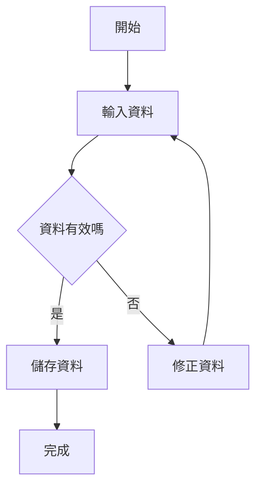

# 說明文件流程圖

說明文件若包含流程圖時，以垂直流程圖為主

## 使用規範

- Mermaid 流程圖預設使用 `flowchart TD`，讓流程由上而下閱讀。
- 依照實際流程安排節點順序，主要路徑維持由上到下。
- 判斷、分支與回圈也應優先維持垂直方向，避免不必要的左右展開。
- 只有在垂直版會造成嚴重擁擠、無法清楚表達，或圖表本質是橫向比較時，才改用其他方向。
- 流程圖節點文字保持簡潔；複雜流程拆成多張圖或使用子流程，避免單張圖過度延伸。
- 新增或修改流程圖後，確認 Mermaid 語法正確，並檢查在窄螢幕與放大閱讀時仍可理解。

## 範例

