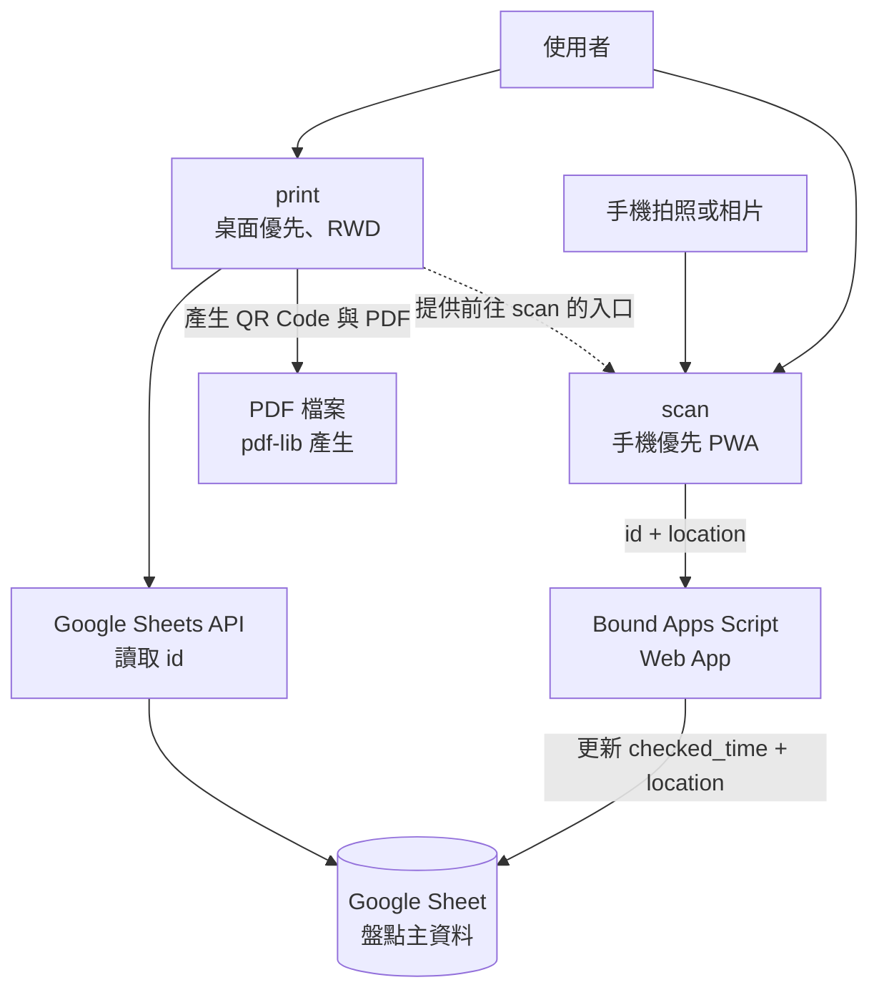
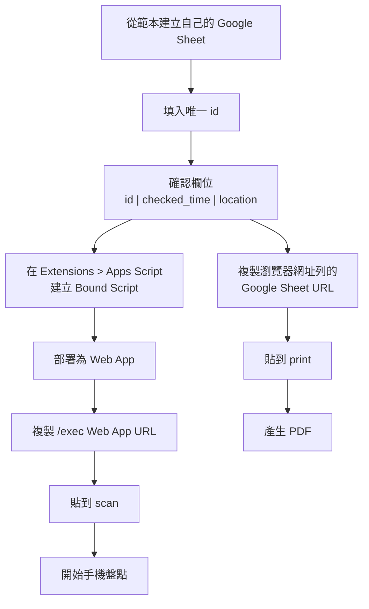
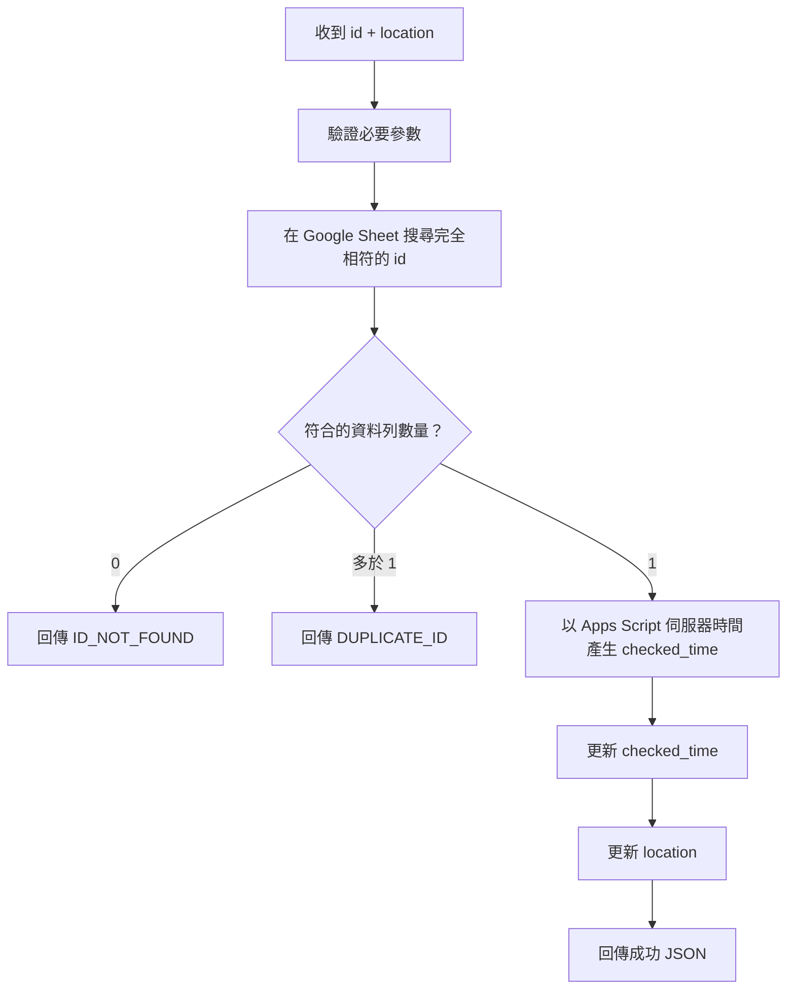
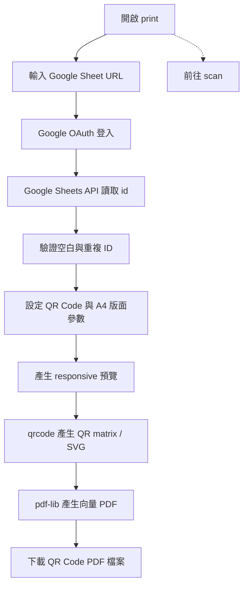
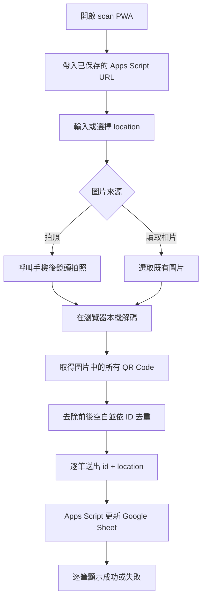

# Mobile Inventory Scanner 系統架構

本文件定義整個專案的共通流程、資料契約與元件責任。三個元件的實作細節分別放在：

- [`google_sheet/README.md`](../google_sheet/README.md)：Google Sheet 範本、網址取得方式與 Bound Apps Script Web App。
- [`print/README.md`](../print/README.md)：從 Google Sheet 讀取 ID、產生 QR Code 與 PDF。
- [`scan/README.md`](../scan/README.md)：手機 QR Code 圖片辨識與盤點寫入 PWA。
- [`packages.md`](packages.md)：前端 npm 套件與瀏覽器 API 清單。

若元件文件與本文件的共通契約不一致，先以本文件為準，再同步修正元件文件。

---

## 1. 整體目標

系統以 Google Sheet 作為盤點主資料表。每筆資料至少包含：

| 欄位 | 用途 |
| --- | --- |
| `id` | 盤點項目的唯一識別碼，也是 QR Code 的內容 |
| `checked_time` | 最近一次成功盤點時間 |
| `location` | 最近一次成功盤點的位置 |

`print` 與 `scan` 都是純前端靜態 Vue App，不建立自有後端。`print` 的預設操作環境是電腦，但版面必須支援平板與手機 RWD；`scan` 則以手機操作為優先，同樣支援較大的螢幕。



QR Code payload 只包含 `id` 本身，不包含 URL、JSON、位置或時間。`print` 可以連結到 `scan`，但不負責更新盤點資料；盤點寫入的唯一入口是 Apps Script。

---

## 2. 元件劃分

```text
Mobile-Inventory-Scanner/
├── docs/
│   ├── architecture.md
│   └── packages.md
├── google_sheet/
│   ├── README.md
│   ├── GET_APPS_SCRIPT_URL.md
│   ├── GET_GOOGLE_SHEET_URL.md
│   └── main.gs
├── print/
│   └── README.md
└── scan/
    └── README.md
```

### `google_sheet/`

負責 Google Sheet 欄位規格、Bound Apps Script 與 Web App API：

- 依 `id` 找出對應列。
- 確認 ID 唯一。
- 成功盤點時寫入 `checked_time` 與 `location`。
- 回傳統一 JSON 結果。
- 在文件中教學如何取得 Google Sheet URL 與 Apps Script Web App URL。

### `print/`

負責讀取資料與產生 QR Code PDF：

- 以電腦為主要操作環境，支援平板與手機 RWD。
- 使用者輸入 Google Sheet URL，並以 Google OAuth 讀取有權限的 Sheet。
- 讀取 `id` 清單並產生 QR Code。
- 顯示 responsive 預覽。
- 使用 `qrcode` 產生 QR Code，使用 `pdf-lib` 產生可下載的 PDF 檔案。
- 提供「前往 scan」的連結或按鈕，方便在手機上切換到盤點頁。

`print` 不呼叫 Apps Script 寫入盤點結果，也不把盤點資料寫回 Google Sheet。

### `scan/`

負責手機端圖片辨識與盤點寫入：

- 以手機瀏覽器 / PWA 為主要操作環境。
- 使用者輸入 Apps Script Web App URL 與目前位置。
- 透過拍照或相片選擇器取得單張圖片。
- 在瀏覽器本機辨識同一張圖片中的一個或多個 QR Code。
- 同一張圖片中的重複 ID 只送出一次。
- 每個 ID 個別呼叫 Apps Script，單筆失敗不能中止其他 ID。

第一版不使用持續開啟的 Camera Preview，主要操作方式是「拍照」與「讀取相片」。

---

## 3. 建立與取得網址流程

使用者需要從同一份 Google Sheet 取得兩個網址：`print` 使用 Google Sheet URL；`scan` 使用 Apps Script Web App URL。



完整的畫面操作與權限設定請依 [`google_sheet/README.md`](../google_sheet/README.md) 執行。`id` 必須視為字串，且在同一張表中唯一。

---

## 4. Apps Script API 與資料寫入

Apps Script Web App 接收：

```json
{
  "id": "A01",
  "location": "主機房 A 區"
}
```

寫入流程：



正式 `checked_time` 只由 Apps Script 產生，不使用手機時間。預設時區是 `Asia/Taipei`，規格格式為：

```text
YYYYMMDD-HHmmSS
```

Apps Script 使用 `Utilities.formatDate` 時，對應的格式字串為 `yyyyMMdd-HHmmss`。例如：

```text
20260829-171000
```

成功回傳：

```json
{
  "success": true,
  "item": {
    "id": "A01",
    "checked_time": "20260829-171000",
    "location": "主機房 A 區"
  },
  "message": "Inventory check succeeded"
}
```

失敗回傳：

```json
{
  "success": false,
  "id": "A99",
  "error": "ID_NOT_FOUND",
  "message": "Item ID not found: A99"
}
```

API 的 `message` 欄位一律使用英文，讓不同前端可以穩定處理；前端可另外將錯誤代碼轉成使用者介面文字。

第一版至少區分：

- `INVALID_ID`
- `INVALID_LOCATION`
- `ID_NOT_FOUND`
- `DUPLICATE_ID`
- `SHEET_NOT_FOUND`
- `COLUMN_NOT_FOUND`
- `WRITE_FAILED`

---

## 5. QR Code 與 PDF 產生流程



每個有效 `id` 產生一個標籤，payload 只有 ID，例如 `A01`。PDF 由瀏覽器本機使用 `pdf-lib` 產生並下載，不透過後端，也不使用瀏覽器 Print 對話框。

第一版 PDF 需求：

- A4 直向或橫向。
- QR Code 使用實體 `mm` 尺寸。
- QR Code 與 ID 文字保持在同一標籤。
- 可設定 QR Code 大小、文字大小、標籤間距、頁面邊界。
- 自動計算每列數量與換頁。
- 標籤不可跨頁切斷。
- QR Code 保留足夠 quiet zone，使用向量模組避免放大失真。

---

## 6. 手機盤點流程



QR decode 必須支援 multi-code detection，不能只處理第一個結果。影像不離開使用者裝置；若同一張圖片有多筆 ID，其中一筆失敗時仍要繼續處理其他 ID。

結果至少顯示 ID、處理狀態、成功時的 `checked_time` 與 `location`，以及失敗時的 API `error` / `message`。

---

## 7. `print` 與 `scan` 的連接方式

兩個 App 仍是獨立部署、獨立設定的靜態網站，但 `print` 必須提供前往 `scan` 的入口：

- 同網域部署時，優先使用相對路徑連結。
- 不同網域部署時，由 `VITE_SCAN_APP_URL` 設定 `scan` 網址。
- 連結可以是按鈕或導覽項目，不得改變 QR Code payload。
- QR Code 仍只包含 `id`，不可把 `scan` URL、Apps Script URL 或 Sheet URL 編入 QR Code。
- `scan` 不需要 Google Sheet URL，只需要 Apps Script Web App URL。

因此使用者可以在電腦的 `print` 產生 PDF，也可以在平板或手機開啟 `print` 後直接切換到 `scan`。

---

## 8. localStorage 與網路需求

`print` 與 `scan` 都是純前端網頁。使用者輸入的設定集中透過 wrapper / composable 保存，不把 `localStorage` 當成正式盤點資料庫。

`print` 至少保存：

- `mis.print.google_sheet_url`
- `mis.print.qr_size_mm`
- `mis.print.id_font_size_pt`
- `mis.print.qr_text_gap_mm`
- `mis.print.label_gap_mm`
- `mis.print.page_margin_mm`
- `mis.print.orientation`

`scan` 至少保存：

- `mis.scan.apps_script_url`
- `mis.scan.location`
- `mis.scan.location_history`

網路需求：

- `print` 讀取 Google Sheet 與 Google API 時需要網路；PDF 產生本身在瀏覽器本機完成。
- `scan` 的 App shell 與 QR decode 靜態資源可由 PWA cache 再次啟動，但寫入 Apps Script 仍需要網路。
- 第一版不做離線盤點 queue；無法連線的項目不可標記為成功。

---

## 9. 前端與 Apps Script 責任界線

前端負責：

- 使用者介面與 RWD。
- `print` 的 Google OAuth、Sheet 讀取、QR Code 預覽與 PDF 產生。
- `scan` 的圖片取得、multi-code QR decode、去重與結果呈現。
- localStorage 設定保存。
- 呼叫 Apps Script 並依回應顯示狀態。

Apps Script 負責：

- 驗證輸入。
- 查找並確認 ID 唯一。
- 產生正式盤點時間。
- 更新 Google Sheet。
- 回傳成功或錯誤 JSON。

Apps Script 是盤點寫入的唯一權威來源；`scan` 不可在 API 回傳失敗時自行判定為成功，`print` 也不可直接修改 Sheet。

---

## 10. 安全性與第一版範圍

安全性原則：

- Repository 不存 Google 帳號密碼、OAuth Client Secret 或 service account private key。
- Google OAuth Client ID 可以作為前端公開設定，但 Client Secret 不得進入 bundle。
- URL 與使用者偏好只保存於瀏覽器 localStorage。
- Google Sheet 不因 `print` 而被迫設為完全公開；存取權限依 `print/README.md` 的 OAuth 流程設定。
- Apps Script Web App 存取權限依實際環境設定，組織環境優先限制在組織帳號。

第一版不做：

- 持續 Camera Preview 即時掃描。
- GPS 自動定位。
- 手機端產生正式 `checked_time`。
- 離線盤點 queue。
- 自建後端伺服器或資料庫。
- 將 QR Code 內容做成 URL 或 JSON。
- 保存完整盤點歷史資料表。
- 在 `scan` 前端直接修改 Google Sheet。

第一版的責任關係固定為：

```text
Google Sheet = 主資料
Apps Script = 盤點寫入 API
print = QR Code PDF 產生工具
scan = 手機圖片掃描 / 盤點工具
```

---

## 11. 國際化（i18n）設計

### 技術選擇

`scan` 與 `print` 雖然都是純前端靜態網站，但實際技術棧是 Vue 3 + TypeScript + Vite。因此採用 Vue 生態系的 [`vue-i18n`](https://vue-i18n.intlify.dev/)；不使用自製 `i18n.js`、執行期 CDN 字典或自建翻譯 API。這樣可以直接整合 Composition API、插值、複數、locale 格式化與 TypeScript 型別。

兩個 App 維持獨立依賴，各自於 `package.json` 與 `package-lock.json` 加入：

```text
vue-i18n
```

翻譯資源會隨各 App 的 Vite bundle 部署，正式環境仍只需要靜態檔案伺服器。

### 資源與初始化

兩個 App 都遵循以下結構：

```text
src/
└── i18n/
    ├── index.ts
    └── messages/
        ├── en.ts
        └── zh_tw.ts
```

- 使用 `createI18n({ legacy: false })`，元件透過 `useI18n()` 使用 Composition API。
- locale 值使用標準 BCP 47 格式：`en`、`zh-TW`；翻譯檔名則遵循專案的 `snake_case` 命名規範。
- 第一版預設 `zh-TW`，fallback 使用 `en`。
- 初始化優先順序為：App 專用 localStorage 設定、`navigator.languages` / `navigator.language`、預設 `zh-TW`。
- 語系切換立即更新畫面，並同步設定 `document.documentElement.lang`。
- 翻譯 key 使用具命名空間的 `snake_case`，例如 `common.cancel`、`scan.capture_qr_code`、`print.download_pdf`。各語系必須維持相同 key schema，缺少 key 應由測試或 CI 發現。

語系偏好不作為正式資料，只透過既有設定 wrapper / composable 保存：

- `mis.scan.locale`
- `mis.print.locale`

元件不可直接呼叫 `localStorage`。`scan` 與 `print` 因為是獨立 App，各自保存自己的語系設定。

### 使用範圍與資料界線

- 所有使用者可見文字都必須來自翻譯資源，包括表單 label、按鈕、錯誤、loading、成功訊息、ARIA label、live region 與 PDF 標籤文字。
- 使用 `vue-i18n` 的插值與複數功能處理變數文字，不以字串串接組合句子；日期與數字依目前 locale 使用 `Intl` 或 `vue-i18n` 格式化。
- Apps Script / Google API 的英文 `message` 與 `error` code 仍是穩定的資料契約。前端依 `error` code 映射本地化訊息，不把翻譯後文字送回 API。
- `id`、`location` 與其他使用者資料是資料內容，不翻譯；API 回應也不可直接當成 UI 文字而跳過錯誤映射。
- 語系選擇器使用有明確 label 的原生 `<select>`，保留鍵盤操作與可存取名稱；切換語系後，重要狀態通知也必須使用目前語系。

### 驗證要求

除一般前端 build 外，i18n 至少驗證：

1. `zh-TW` 與 `en` 都能載入，且沒有缺少翻譯 key。
2. 手動切換後，靜態文字、動態狀態、ARIA / live region、PDF 標籤與 `html[lang]` 都同步更新。
3. reload 後會依 App 專用的 `mis.*.locale` 設定還原語系，沒有直接依賴瀏覽器語系覆蓋使用者選擇。
4. QR Code 辨識、逐筆送出、錯誤與完成摘要等無障礙通知在兩種語系都可理解。
