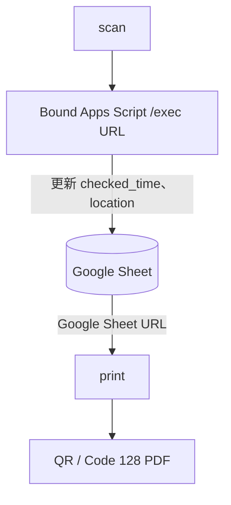
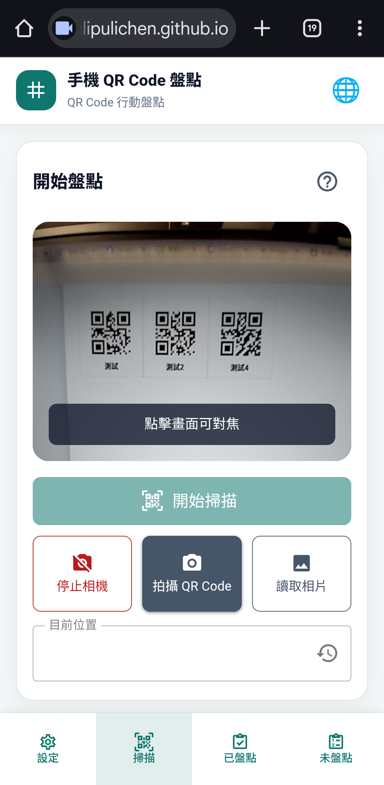

# Mobile Inventory Scanner 使用說明

Mobile Inventory Scanner 是一套以 Google Sheet 管理盤點資料的 QR Code 盤點工具，包含兩個獨立網頁：

- `print`：從 Google Sheet 讀取 ID，產生 QR Code 或 Code 128 標籤 PDF。
- `scan`：使用手機相機、照片或刷槍輸入 ID，辨識 QR Code 與 Code 128，將盤點時間與位置寫回 Google Sheet。

兩個網頁都在瀏覽器本機執行，不需要另外安裝手機 App，也不需要自建後端。

## 1. 使用前準備

開始前請準備：

1. 一個 Google 帳號。
2. 一份盤點用 Google Sheet。
3. 可存取該 Google Sheet 的權限。
4. `print` 網址與 `scan` 網址。
	1. print 網址: https://pulipulichen.github.io/Mobile-Inventory-Scanner/print/dist/
	2. scan 網址:  https://pulipulichen.github.io/Mobile-Inventory-Scanner/scan/dist/
5. 一個已部署完成、結尾為 `/exec` 的 Apps Script Web App URL。
6. 可連線到網路的電腦與手機。

### 1.1 系統資料流



---

## 2. 建立 Google Sheet

### 2.1 從範本建立副本

第一次使用請從官方範本建立自己的副本，不要直接在共用範本上填資料。

- 建立副本：[建立我的副本](https://docs.google.com/spreadsheets/d/1XA-VP_7g0Op-1s_LTjNroFOsOA4DvJEyGq8GaytCkCI/copy)
- 查看範本：[初始化 Google Sheet](https://docs.google.com/spreadsheets/d/1XA-VP_7g0Op-1s_LTjNroFOsOA4DvJEyGq8GaytCkCI/edit?gid=0#gid=0)

副本已包含正確的第一列欄位。建立後請在自己的試算表填入盤點資料，再把該副本網址提供給 `print` 使用。

### 2.2 第一列欄位

若自行建立空白試算表，請將第一列設定為以下欄位名稱，大小寫與底線都必須正確：

| 欄位 | 必要性 | 用途 |
| --- | --- | --- |
| `id` | 必填 | 盤點項目的唯一識別碼，也是 QR Code 的內容 |
| `name` | 建議填寫 | 項目名稱，方便使用者辨識 |
| `checked_time` | 必填 | 最近一次成功盤點時間，由 Apps Script 寫入 |
| `location` | 必填 | 最近一次成功盤點的位置 |

範例：

| id | name | checked_time | location |
| --- | --- | --- | --- |
| A01 | 印表機 | — | 主機房 A 區 |
| B03 | 桌上型電腦 | — | 倉庫 2F |
| C04 | 筆記型電腦 | — | — |

`checked_time` 留白表示尚未盤點。請不要把欄位名稱翻譯成中文，也不要在欄位名稱前後加入空白。


### 2.3 `id` 注意事項

- 每個非空 `id` 必須唯一。
- `id` 會以文字處理，請避免 Google Sheet 自動把前導零移除。
- QR Code 只包含 `id`，不包含網址、JSON、位置或盤點時間。
- 空白 ID 列會被忽略。
- 如果同一個 ID 出現多次，`print` 不會產生 PDF，Apps Script 也不會任意選擇其中一列寫入。

### 2.4 Google Sheet 權限

`print` 會由瀏覽器直接下載 Google Sheet 的 CSV，因此該試算表必須能讓瀏覽器直接取得資料。若載入失敗，請確認：

- 試算表分享權限允許使用者檢視；或
- 該試算表已發布至網路；且
- 使用者貼上的網址確實是 Google Sheet 網址，而不是 Google Drive 資料夾網址。

詳細說明請參考 [`google_sheet/GET_GOOGLE_SHEET_URL.md`](../google_sheet/GET_GOOGLE_SHEET_URL.md)。

---
## 3. 部署 Apps Script

Apps Script 是 `scan` 寫入盤點結果的唯一入口。請使用與盤點用 Google Sheet 綁定的 Apps Script。

細節操作請看 [GET_APPS_SCRIPT_URL](../google_sheet/GET_APPS_SCRIPT_URL.md)

部署完成後可取得結尾為 `/exec` 的部署網址，例如：

```text
https://script.google.com/macros/s/<DEPLOYMENT_ID>/exec
```

此網址將會用於 `scan` 當中。

### 3.3 更新 Apps Script

如果修改了 `main.gs`，請儲存程式後更新既有部署或建立新版本，並確認 `scan` 仍使用更新後的 `/exec` 網址。只修改編輯器內容而沒有更新部署，正式 Web App 不會套用新程式。

---

## 4. 產生標籤 PDF

### 4.1 開啟 `print`

正式工具： [QR Code 標籤產生器](https://pulipulichen.github.io/Mobile-Inventory-Scanner/print/dist/)

### 4.2 載入 Google Sheet

1. 開啟 `print`。
2. 將完整的 Google Sheet URL 貼到「Google Sheet 網址」欄位。
3. 系統會自動載入第一個工作表；也可以按「載入資料」或「重新載入資料」。
4. 確認畫面顯示有效 ID 數量與試算表名稱。

若不知道試算表網址，可按欄位旁的「開啟最近使用的 Google Sheet」，在新分頁選取試算表後，複製瀏覽器網址列的完整網址貼回 `print`。


### 4.3 處理重複 ID

如果資料中有重複 ID，頁面會列出該 ID 出現的儲存格位置，例如：

```text
A01：A2、A8、A14
```

請回到 Google Sheet 修正重複資料，再回到 `print` 按「重新載入資料」。在所有重複 ID 修正以前，系統不會提供 QR Code 預覽或 PDF 下載。

### 4.4 設定標籤

「列印設定」修改後會立即更新預覽。常用設定如下：

| 設定 | 說明 |
| --- | --- |
| 條碼格式 | QR Code、Code 128，或兩者同時列印 |
| 紙張尺寸 | A4、A3、A5、B4、B5 |
| 紙張方向 | 直向或橫向 |
| QR Code 尺寸 / 條碼寬度 | QR Code 的實體邊長，或 Code 128 的實體寬度，單位為 mm |
| 標籤文字 | 不顯示、顯示 ID，或顯示名稱 |
| 文字大小 | 圖碼下方文字的大小，單位為 pt |
| QR／文字間距 | QR Code 或條碼與文字之間的距離 |
| 標籤間距 | 相鄰標籤之間的距離 |
| 頁面邊界 | 標籤與紙張邊緣之間的距離 |

建議第一次使用時：

- 紙張選擇實際使用的尺寸，通常為 A4。
- 條碼格式先使用 QR Code；若要用刷槍或一維條碼掃描，再改為 Code 128。
- QR Code 或條碼寬度先使用預設尺寸。
- 標籤文字選擇「ID」或「名稱」，方便紙本人工辨識。
- 確認預覽中的圖碼與文字位於同一個標籤內。

所有設定會保存於目前瀏覽器。

### 4.5 檢查預覽與下載 PDF

1. 在「預覽」區確認標籤總數、每列數量、每頁列數與總頁數。
2. 確認每個標籤的 QR Code 或 Code 128 下方的 ID 或名稱與預期相符。
3. 按「下載 PDF」。
4. 開啟下載的 PDF，檢查頁面方向與標籤排列。
5. 以實際印表機或影印店使用 100% 原尺寸列印，不要讓列印程式自動縮放。

`print` 產生的是向量 PDF，不會直接控制實體印表機。列印完成後，請確認紙本 QR Code 或條碼附近仍有可閱讀的 ID 或名稱；不要只依賴圖碼判斷項目。

Code 128 只支援英數與常見符號。若 ID 含有中文或其他不支援字元，請改用 QR Code，或先修正 Google Sheet 中的 ID。


### 4.6 掃描模擬

`print` 也提供「掃描模擬」模式，可在電腦螢幕上建立 QR Code 場景，再用另一支手機的 `scan` 掃描。

1. 先載入沒有重複 ID 的 Google Sheet。
2. 將輸出模式切換為「掃描模擬」。
3. 選擇 QR Code 數量與顯示尺寸。
4. 按「建立場景」。
5. 需要時調整場景縮放、重新排列或進入全螢幕。
6. 在另一台裝置開啟 `scan` 進行測試。

掃描模擬不是正式盤點的替代品；它適合在列印前驗證 QR Code 是否能被手機辨識。

## 5. 使用手機 `scan` 盤點

### 5.1 開啟 `scan`

正式工具：

- [行動盤點掃描工具](https://pulipulichen.github.io/Mobile-Inventory-Scanner/scan/dist/)

建議使用 Android Chrome 或 iPhone Safari。也可以將網頁加入手機主畫面，以 PWA 方式開啟。

`scan` 不註冊 Service Worker，也不支援離線盤點；盤點寫入需要網路連線。

### 5.2 第一次設定


1. 開啟 `scan`。
2. 在「Apps Script /exec 網址」欄位貼上部署完成的 Apps Script `/exec` URL。
3. 在「目前位置」輸入本次要盤點的區域，例如 `主機房 A 區`。
4. 按「確認設定並開始掃描」。
5. 設定正確後，畫面會切換到「掃描」分頁。

目前位置可以留白。留白時，成功盤點只會更新 `checked_time`，保留該 ID 在 Google Sheet 原本的 `location`。如果輸入新的位置，成功盤點後會更新該 ID 的位置。

已輸入過且格式正確的 `/exec` URL 會保存於目前瀏覽器，下次開啟時可以直接使用。成功盤點過的位置也會出現在歷史位置選單中。

### 5.3 即時相機掃描

「掃描」分頁卡片右上角可用下拉選單在「相機」與「刷槍」之間切換，選擇會保存在目前瀏覽器。

相機模式：

1. 切換到「掃描」分頁，並在右上角選單選擇「相機」。
2. 按「開始掃描」。
3. 第一次使用時，請允許瀏覽器使用相機。
4. 使用手機後置鏡頭對準 QR Code 或 Code 128。
5. 將條碼保持在畫面中，直到頁面顯示已辨識。
6. 可一次讓畫面中出現多個 QR Code 或 Code 128。
7. 完成一批掃描後，等待 3 秒沒有新的 ID，系統會自動批次送出。
8. 在「已盤點」分頁查看每個 ID 的處理結果。
9. 完成後按「停止相機」釋放相機。

相機掃描期間可以點擊預覽畫面重新對焦；無法使用滑鼠時，也可以將焦點移到預覽控制項後按 Enter 對準畫面中央。



### 5.4 刷槍輸入

如果使用手持刷槍或條碼機：

1. 在「掃描」分頁右上角選單把輸入方式切換成「刷槍」。
2. 確認游標在「刷槍輸入 ID」欄位。
3. 連續掃描多個 ID。刷槍通常會自動送出 Enter。
4. 也可以手動輸入 ID 後按 Enter，或按「加入這個 ID」。
5. 3 秒內沒有新的輸入時，系統會把目前等待中的 ID 一次送到 Google Sheet。

刷槍模式與相機掃描共用同一個 3 秒批次送出與 10 秒重複冷卻規則。重新整理頁面後，會維持上次選擇的輸入方式。

### 5.5 拍攝條碼

如果即時相機無法使用，請先在右上角選單切換成「相機」輸入方式：

1. 在「掃描」分頁按「拍攝條碼」。
2. 使用手機後置鏡頭拍攝一張照片。
3. 拍照完成後，系統會在瀏覽器本機辨識照片中的 QR Code 與 Code 128。
4. 若沒有辨識到條碼，請調整距離、光線或照片角度後重新拍攝。

### 5.6 讀取既有相片

1. 按「讀取相片」。
2. 從手機照片或檔案選擇器選取一張圖片。
3. 系統會辨識圖片中的 QR Code 與 Code 128。
4. 若照片無法讀取或沒有條碼，請重新選擇清楚的圖片。

相機影像與照片都只在目前瀏覽器本機辨識，不會上傳到本工具。

### 5.7 重複辨識與批次送出

- 同一張照片中的相同 ID 只會保留一次。
- 即時掃描時，同一個 ID 在 10 秒內不會重複送出。
- 掃描到新的 ID 後，若 3 秒內沒有更多新 ID，系統會將目前等待中的 ID 一次送出。
- 一批中某一個 ID 失敗，不會中止其他 ID。
- 系統會從 Google Sheet 重新確認寫入結果，不會只依手機端的送出畫面判定成功。

掃描時不要在批次送出或確認期間更換目前位置。變更位置會清除本次盤點結果，避免把同一批結果誤認為新位置的盤點。

## 6. 查看盤點結果

### 6.1 已盤點

「已盤點」分頁會列出目前這次使用 `scan` 處理的 ID。每筆資料可能顯示：

- 等待批次送出
- 寫入 Google Sheet 中
- 盤點成功，包含 `checked_time`
- 盤點成功，包含 `checked_time` 與 `location`
- 盤點失敗與錯誤原因

Apps Script 產生的正式盤點時間格式為：

```text
YYYYMMDD-HHmmSS
```

例如：

```text
20260829-171000
```

時間由 Apps Script 伺服器產生，使用試算表時區，預設為 `Asia/Taipei`，不是手機本機時間。

{IMAGE: scan 的「已盤點」分頁，顯示多筆 ID、成功狀態、checked_time 與 location}

### 6.2 尚未盤點

1. 切換到「未盤點」分頁。
2. 按「列出尚未盤點的 ID」。
3. 系統會讀取 `checked_time` 為空白的資料。
4. 項目會依 Google Sheet 目前的 `location` 分組。
5. 與目前位置相同的群組會優先顯示。
6. 沒有位置的項目會放在「尚未設定位置」群組。

這份清單是按下按鈕時重新讀取的結果，不是離線快取。讀取失敗時，頁面會顯示錯誤，不應將錯誤誤解為「沒有尚未盤點項目」。


## 7. 常見問題與處理方式

### 7.1 `print` 無法載入 Google Sheet

請依序確認：

1. 貼上的是完整 Google Sheet URL，例如：

   ```text
   https://docs.google.com/spreadsheets/d/<SPREADSHEET_ID>/edit
   ```

2. 試算表可由瀏覽器直接下載 CSV。
3. 第一個工作表有 `id` 欄位。
4. `id` 欄位至少有一筆非空資料。
5. 網路連線正常。
6. 修正權限或資料後按「重新載入資料」。

### 7.2 顯示缺少必要欄位

請確認第一列至少包含：

```text
id | checked_time | location
```

建議同時保留：

```text
name
```

欄位名稱必須使用小寫英文與底線。

### 7.3 顯示重複 ID

請依錯誤訊息列出的 A1 儲存格位置回到 Google Sheet，刪除或修改重複的 ID，再按「重新載入資料」。在重複資料修正前，系統不會產生 QR Code PDF。

### 7.4 `scan` 顯示 Apps Script URL 無效

請確認：

- 貼上的是 Apps Script Web App URL，而不是 Google Sheet URL。
- 網址結尾是 `/exec`。
- 沒有貼上 `/dev`。
- 網址前後沒有多餘空白或換行。
- 該部署仍然存在，且已更新到最新版本。

### 7.5 相機無法啟動

請確認：

- 使用 HTTPS 網址。
- 已在瀏覽器允許相機權限。
- 沒有其他 App 正在獨佔相機。
- 使用支援相機的 Android Chrome 或 iPhone Safari。

若仍然無法使用，請改按「拍攝條碼」或「讀取相片」。

### 7.6 條碼辨識不到

請嘗試：

- 增加光線，避免反光。
- 讓 QR Code 或 Code 128 完整出現在照片或預覽範圍內。
- 調整手機與條碼的距離。
- 確認條碼沒有被裁切、折彎或嚴重模糊。
- Code 128 請儘量水平對準畫面中央，並讓整條條碼都進入鏡頭。
- 列印時使用 100% 原尺寸，不要縮放得過小。
- 用 `print` 的掃描模擬先測試標籤。

### 7.7 盤點結果沒有寫入

請確認：

1. 手機仍可連線到網路。
2. Apps Script URL 是正確的 `/exec` 部署網址。
3. Apps Script 部署的執行者有該 Google Sheet 的編輯權限。
4. Google Sheet 中的 ID 與 QR Code 或 Code 128 內容完全一致。
5. Google Sheet 沒有重複 ID。
6. `checked_time` 與 `location` 欄位仍存在。
7. 若剛修改 `main.gs`，已更新 Apps Script 部署版本。

若只有單筆失敗，請查看該筆顯示的錯誤；同一批其他成功項目不需要重新盤點。

### 7.8 變更位置後結果消失

這是預期行為。為避免把不同位置的結果混在一起，只要變更目前位置，`scan` 就會清除本次盤點結果。請先設定正確位置，再開始掃描。

## 8. 權限、隱私與資料安全

- QR Code 與 Code 128 圖片與相機影像只在瀏覽器本機辨識，不會上傳照片。
- `print` 會將 Google Sheet CSV 載入瀏覽器，PDF 也在瀏覽器本機產生。
- `scan` 使用 Apps Script `/exec` URL 讀取未盤點清單與寫入盤點結果。
- QR Code 與 Code 128 payload 只有 `id`，不包含位置、時間或 Google URL。
- Apps Script `/exec` URL 可能讓持有網址的人讀取 ID、名稱與位置，並依部署權限呼叫寫入功能；請不要把它公開貼在不必要的地方。
- 不要將 Google 帳號密碼、OAuth Client Secret、service account private key 或其他秘密放進前端或 Git repository。
- 若資料不適合公開，請在 Apps Script 部署時限制存取對象，不要選擇 **Anyone**。

## 9. 無障礙操作

主要流程可以使用鍵盤完成：

- 使用 Tab / Shift+Tab 移動焦點。
- 使用 Enter 或 Space 啟動按鈕。
- 使用原生選單選擇語言、紙張與位置。
- QR Code 的 ID 與名稱會以文字顯示在頁面中，不只依賴圖片或顏色。
- 掃描、送出、成功、失敗與完成統計會以文字狀態通知。
- 相機無法使用時，可以改用拍照、讀取相片，或切換成刷槍輸入。

若使用螢幕閱讀器，請留意「已盤點」分頁中的每筆結果與「未盤點」分頁中的位置群組，這些內容會以語意化清單呈現。

## 10. 快速檢查清單

### 管理者第一次設定

- [ ] Google Sheet 第一列是 `id`、`name`、`checked_time`、`location`。
- [ ] 每個非空 ID 都是唯一值。
- [ ] `print` 可以載入 Google Sheet。
- [ ] Apps Script 已使用 `main.gs` 建立 Bound Script。
- [ ] Apps Script 已部署為 Web app。
- [ ] 已取得結尾為 `/exec` 的 Web App URL。
- [ ] `scan` 可以確認設定並開啟掃描分頁。

### 每次列印

- [ ] Google Sheet 資料已更新。
- [ ] `print` 已重新載入資料。
- [ ] 沒有重複 ID。
- [ ] 預覽中的標籤數量與資料筆數相符。
- [ ] QR Code 尺寸與紙張設定符合需求。
- [ ] PDF 已下載並檢查。
- [ ] 實體列印使用原尺寸，且紙本保留可閱讀的 ID 或名稱。

### 每次手機盤點

- [ ] `scan` 使用正確的 `/exec` URL。
- [ ] 已設定正確的目前位置。
- [ ] 手機已允許相機權限，或已準備照片替代流程。
- [ ] 已查看「已盤點」結果。
- [ ] 批次送出與確認完成後，再離開頁面。
- [ ] 需要時重新載入「未盤點」清單確認剩餘項目。

## 11. 相關文件

- [`google_sheet/README.md`](../google_sheet/README.md)：Google Sheet 欄位、Apps Script API 與資料契約。
- [`google_sheet/GET_GOOGLE_SHEET_URL.md`](../google_sheet/GET_GOOGLE_SHEET_URL.md)：取得 Google Sheet URL。
- [`google_sheet/GET_APPS_SCRIPT_URL.md`](../google_sheet/GET_APPS_SCRIPT_URL.md)：部署並取得 Apps Script `/exec` URL。
- [`print/README.md`](../print/README.md)：QR Code PDF 產生功能規格。
- [`scan/README.md`](../scan/README.md)：手機掃描與盤點功能規格。
- [`architecture.md`](./architecture.md)：系統架構與元件責任。
