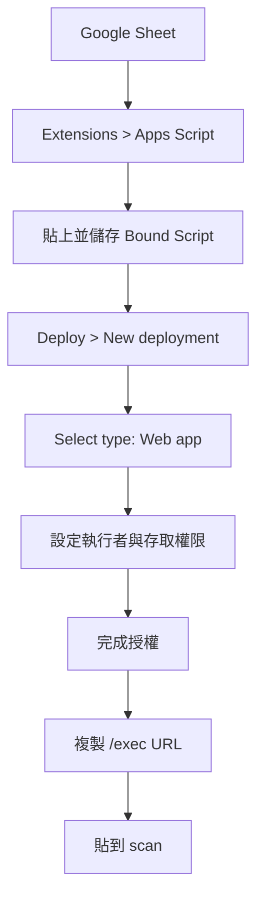

# 取得 Apps Script Web App URL

`scan` 透過 Apps Script Web App 將 `id` 與 `location` 傳回同一份 Google
Sheet。建議使用與試算表綁定的 **Bound Script**，讓程式可以直接取得目前
的 Spreadsheet。

## 操作步驟

1. 在盤點用 Google Sheet 選擇 **Extensions > Apps Script**。
2. 將本專案的 Apps Script 程式碼貼到編輯器，確認它使用目前綁定的
   Spreadsheet，並儲存專案。
3. 選擇 **Deploy > New deployment**。
4. 在 **Select type** 選擇 **Web app**。
5. **Execute as** 選擇執行部署者（通常是 **Me**），讓程式能更新這份
   Sheet。
6. 設定 **Who has access**：
   - 組織內使用：選組織帳號可存取的選項。
   - 需要未登入的手機直接呼叫：選 **Anyone**，但必須妥善保護 URL。
7. 按 **Deploy**，完成 Google 授權後複製 **Web app URL**。
8. 將網址貼到 `scan` 的 Apps Script Web App URL 欄位。正式使用請複製結尾
   為 `/exec` 的網址；`/dev` 只供部署者測試，不要交給使用者。

若部署後修改 Apps Script 程式碼，需依 Google 的部署流程建立新版本或更新
既有 deployment，並確認 `scan` 使用的仍是 `/exec` 網址。

完成後可回到 [Google Sheet / Apps Script 規格](./README.md) 查看 Web App
輸入與回傳格式。
