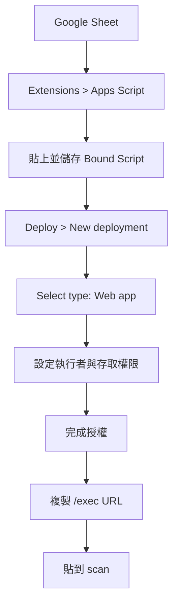

# 取得 Apps Script Web App URL

`scan` 透過 Apps Script Web App 讀取尚未盤點的項目，並將 `id` 與 `location`
寫回同一份 Google Sheet。建議使用與試算表綁定的 **Bound Script**，讓程式
可以直接取得目前的 Spreadsheet。若要先找到盤點用試算表，也可以開啟
[Google Drive 最近使用的 Google Sheet](https://drive.google.com/drive/u/0/recent?q=type:spreadsheet)，
選取試算表後再進入 **Extensions > Apps Script**。

## 操作步驟

![[Pasted image 20260829214238.png]]
1. 在盤點用 Google Sheet 選擇 **Extensions > Apps Script**。

![[Pasted image 20260829214254.png]]
1. 將本專案的 Apps Script 程式碼 `main.gs` 貼到編輯器，確認它使用目前綁定的
   Spreadsheet，並儲存專案。
![[Pasted image 20260829214329.png]]

2. 選擇 **Deploy > New deployment**。
![[Pasted image 20260829214345.png]]
3. 在 **Select type** 選擇 **Web app**。


2. 3. 設定 **Who has access**：
   - 選 **Anyone**，但必須妥善保護 URL。
2. 按 **Deploy**，完成 Google 授權後複製 **Web app URL**。

3. 授予存取權

按Advanced


按Go to 未命名的專案 (unsafe)

Continue


複製網址

4. 將網址貼到 `scan` 的 Apps Script Web App URL 欄位。正式使用請複製結尾
   為 `/exec` 的網址。



若部署後修改 Apps Script 程式碼，需依 Google 的部署流程建立新版本或更新
既有 deployment，並確認 `scan` 使用的仍是 `/exec` 網址。

完成後可回到 [Google Sheet / Apps Script 規格](./README.md) 查看 Web App
輸入與回傳格式。

## 盤點清單 API

同一個 `/exec` URL 同時提供讀取清單的 GET API。`scan` 使用下列網址取得
`checked_time` 空白的項目：

```text
GET https://script.google.com/macros/s/<DEPLOYMENT_ID>/exec?action=pending
```

成功回傳範例：

```json
{
  "success": true,
  "items": [
    {
      "id": "B03",
      "name": "桌上型電腦",
      "checked_time": "",
      "location": "倉庫 2F"
    }
  ],
  "message": "Pending inventory items loaded"
}
```

`scan` 會把有相同 `location` 的項目分在同一組；空白位置會顯示為
「尚未設定位置」。`name` 來自 Sheet 的人類可識別名稱，未填時前端以
`id` 顯示。

若使用瀏覽器直接開啟未帶 `action` 的 `/exec`，只會看到部署健康檢查。
`action=list` 可讀取所有非空 ID，包含已盤點與尚未盤點項目。

### 權限注意事項

GET API 會把盤點表中的 ID、名稱與位置提供給持有 Web App URL 的呼叫者。
若資料不適合公開，請在部署時限制 **Who has access** 為組織或登入帳號，
不要選擇 **Anyone**。選擇 **Anyone** 時，必須把 `/exec` URL 視為敏感設定
妥善保管。
