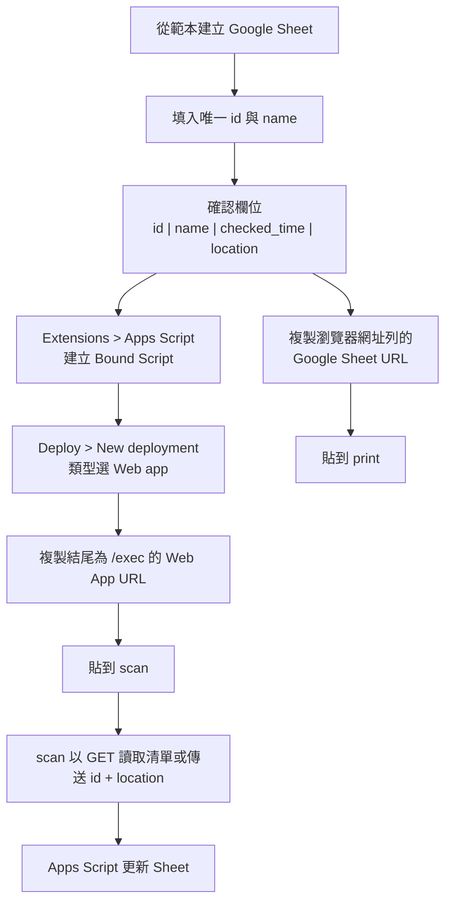

# Google Sheet / Apps Script 規格

本目錄負責盤點用 Google Sheet 範本，以及綁定於該試算表的 Google Apps Script。

共通流程以 [`docs/architecture.md`](../docs/architecture.md) 為準，前端套件
清單見 [`docs/packages.md`](../docs/packages.md)。完成設定後，網址會分別
提供給 [`print/README.md`](../print/README.md) 與
[`scan/README.md`](../scan/README.md) 使用。

## 使用流程



Google Sheet 不需要公開；擁有該試算表權限的使用者即可管理資料與 Apps
Script。兩個網址的詳細取得方式請參考：

- [取得 Google Sheet URL](./GET_GOOGLE_SHEET_URL.md)：提供給 `print` 讀取
  試算表。
- [取得 Apps Script Web App URL](./GET_APPS_SCRIPT_URL.md)：提供給 `scan`
  傳送盤點結果。

---

## Google Sheet 欄位

盤點表使用以下四個欄位：

|欄位|必填|說明|範例|
|---|---|---|---|
|`id`|是|盤點項目的唯一識別碼，也是 QR Code 的內容|`A01`|
|`name`|否|ID 的人類可識別名稱，顯示在尚未盤點清單|`印表機`|
|`checked_time`|否|最近一次成功盤點的日期時間，由 Apps Script 寫入|`20260829-171000`|
|`location`|否|最近一次成功盤點的位置，由掃描端傳入；若傳入空白則保留原值|`主機房 A 區`|

範例：

| `id` | `name` | `checked_time` | `location` |
| --- | --- | --- | --- |
| `A01` | 印表機 | `20260829-171000` | `主機房 A 區` |
| `B03` | 桌上型電腦 | — | 倉庫 2F |
| `C04` | 筆記型電腦 | — | — |

`—` 表示尚未盤點，實際試算表儲存格應保持空白。

`name` 是建議填寫的資料欄位；若暫時留白，前端會以 `id` 作為顯示名稱。
欄位標題必須正好使用小寫 `name`。

### `id` 規則

- 非空 `id` 必須唯一。
- `id` 一律視為字串。
- QR Code 內容就是 `id` 本身，不包 URL、JSON 或其他前後綴。
- 試算表資料列之間可以有空行；空白 ID 列應略過，不視為有效盤點資料。
- 若 Sheet 中出現重複的非空 ID，Apps Script 不應任意更新其中一筆，必須回傳錯誤。

`print` 載入報表時會先檢查非空 `id` 是否重複，並列出重複 ID
以及所有出現的 A1 儲存格位置，例如 `A01：A2、A8`。發現重複時，
`print` 不得產生 QR Code、PDF 或直接列印結果；Apps Script 的重複檢查
仍保留作為盤點寫入時的第二道防護。

### `checked_time`

- 由 Apps Script 伺服器端產生，不採用手機時間。
- 使用試算表 / Apps Script 時區，預設 `Asia/Taipei`。
- 規格顯示格式：`YYYYMMDD-HHmmSS`，例如 `20260829-171000`。
- Apps Script 的 `Utilities.formatDate` 格式字串為 `yyyyMMdd-HHmmss`。

### `location`

- 由手機掃描頁手動輸入。
- Apps Script 收到空白位置時仍可接受請求。
- 位置為空白時，不刪除或覆寫該 ID 原本的 `location` 資料。
- 位置有值時，成功盤點後直接覆寫該 ID 目前的 `location`。

---

## Apps Script 功能

Apps Script 負責「依 ID 寫入盤點結果」以及提供盤點清單讀取 API。

它不負責 QR Code 產生，也不負責手機端圖片辨識。

### Web App 輸入

掃描頁每辨識到一個 QR Code，就送出一筆盤點請求。

輸入至少包含：

```json
{
  "id": "A01",
  "location": "主機房 A 區"
}
```

固定使用 `POST` JSON，讓 `scan` 與 Apps Script 的資料契約一致。

### Web App 讀取尚未盤點清單

`scan` 可對同一個 `/exec` URL 發送：

```text
GET https://script.google.com/macros/s/<DEPLOYMENT_ID>/exec?action=pending
```

Apps Script 會讀取所有非空 `id`，只回傳 `checked_time` 為空白的資料列。
`scan` 再依 `location` 分組；沒有位置的項目歸入「尚未設定位置」。

成功回傳：

```json
{
  "success": true,
  "items": [
    {
      "id": "B03",
      "name": "桌上型電腦",
      "checked_time": "",
      "location": "倉庫 2F"
    },
    {
      "id": "C04",
      "name": "筆記型電腦",
      "checked_time": "",
      "location": ""
    }
  ],
  "message": "Pending inventory items loaded"
}
```

若要讀取全部資料，可使用 `action=list`。未帶 `action` 的 GET 仍只提供
部署健康檢查，不會回傳盤點資料。

### 寫入流程

Apps Script 收到請求後：

1. 驗證 `id` 不為空。
2. 在 `id` 欄尋找完全相符的非空資料，略過中間的空白資料列。
3. 找不到 ID 時回傳盤點失敗。
4. 找到多筆相同 ID 時回傳重複 ID 錯誤。
5. 找到唯一資料列時，以伺服器目前時間更新 `checked_time`。
6. 輸入的位置有值時更新 `location`；位置空白時保留原本的 `location`。
7. 回傳本次盤點結果。

### 成功回傳

```json
{
  "success": true,
  "item": {
    "id": "A01",
    "name": "印表機",
    "checked_time": "20260829-171000",
    "location": "主機房 A 區"
  },
  "message": "Inventory check succeeded"
}
```

### 失敗回傳

```json
{
  "success": false,
  "id": "A99",
  "error": "ID_NOT_FOUND",
  "message": "Item ID not found: A99"
}
```

`message` 欄位一律使用英文；前端若需要繁體中文介面，應依 `error` 代碼
自行映射，不要依賴英文訊息解析業務狀態。

至少區分以下錯誤：

- `INVALID_ID`：ID 為空或格式不合法。
- `ID_NOT_FOUND`：Sheet 找不到該 ID。
- `DUPLICATE_ID`：Sheet 中同一個非空 ID 出現多筆。
- `SHEET_NOT_FOUND`：目標工作表不存在。
- `COLUMN_NOT_FOUND`：必要欄位不存在。
- `WRITE_FAILED`：寫入失敗。

Apps Script 即使發生錯誤，也應盡量回傳 JSON，讓掃描頁可以直接顯示結果。

---

## Apps Script 與試算表關係

建議使用 **Bound Script（綁定試算表的 Apps Script）**。

如此從範本建立副本時，Apps Script 可與試算表一起管理，不需要在程式碼內硬編碼另一份 Spreadsheet ID。

程式可透過目前綁定的 Spreadsheet 取得資料，例如概念上使用：

```javascript
SpreadsheetApp.getActiveSpreadsheet();
```

工作表名稱、欄位名稱與時區可集中在設定區。

---

## 建議目錄

```text
google_sheet/
├── README.md
├── GET_APPS_SCRIPT_URL.md
├── GET_GOOGLE_SHEET_URL.md
└── main.gs
```

---

## 第一版完成條件

- [ ] 有可複製的 Google Sheet 範本。
- [ ] 範本包含 `id`、`name`、`checked_time`、`location` 四欄。
- [ ] Apps Script 可部署成 Web App。
- [ ] Web App 可接收 `id` 與 `location`。
- [ ] Web App 的 `GET?action=pending` 可回傳尚未盤點的 ID、名稱與位置。
- [ ] 找到 ID 時更新 `checked_time`；位置有值時更新 `location`，空白時保留原值。
- [ ] 找不到 ID 時不修改 Sheet 並回傳錯誤。
- [ ] 重複 ID 時不修改 Sheet 並回傳錯誤。
- [ ] 回傳格式可直接供 `scan` 頁顯示。

## 第一版不做

- 盤點歷程表。
- 新增 / 刪除 / 修改 ID 的 API。
- GPS 定位。
- Apps Script 產生 QR Code。
- Apps Script 處理圖片或辨識 QR Code。
