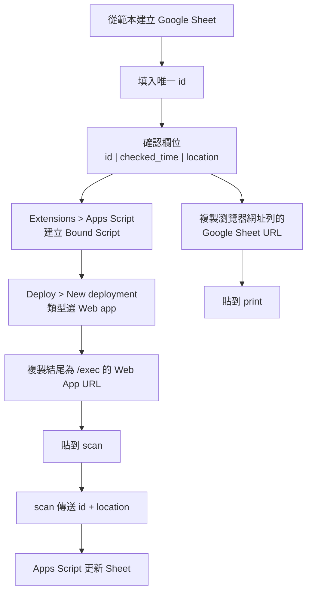
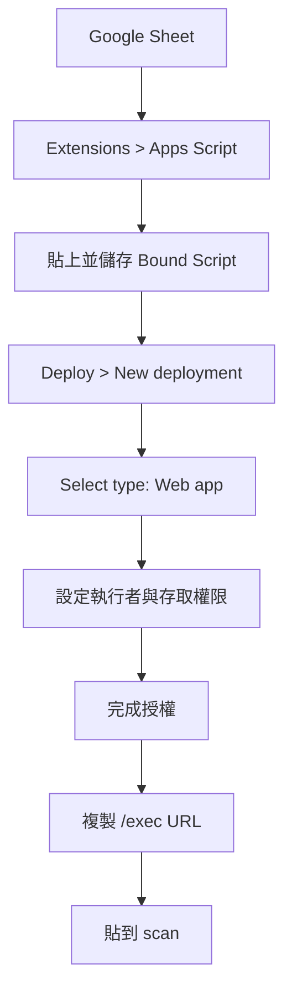

# Google Sheet / Apps Script 規格

本目錄負責盤點用 Google Sheet 範本，以及綁定於該試算表的 Google Apps Script。

共通流程以 [`docs/architecture.md`](../docs/architecture.md) 為準，前端套件
清單見 [`docs/packages.md`](../docs/packages.md)。完成設定後，網址會分別
提供給 [`print/README.md`](../print/README.md) 與
[`scan/README.md`](../scan/README.md) 使用。

## 使用流程



Google Sheet 不需要公開；擁有該試算表權限的使用者即可管理資料與 Apps
Script。完整網址取得方式如下。

## 取得 Google Sheet URL

1. 登入要使用的 Google 帳號，開啟盤點用 Google Sheet。
2. 確認第一列欄位名稱正好是 `id`、`checked_time`、`location`。
3. 將瀏覽器網址列的完整網址複製下來，例如：

   ```text
   https://docs.google.com/spreadsheets/d/<SPREADSHEET_ID>/edit
   ```

4. 將這個網址貼到 `print` 的 Google Sheet URL 欄位。`print` 會透過
   Google OAuth 與 Google Sheets API 讀取，不要求把 Sheet 設為公開。

不要只複製 `<SPREADSHEET_ID>`；前端可接受完整 Google Sheet URL，並會自行
解析 ID。

## 取得 Apps Script Web App URL

1. 在同一份 Google Sheet 選擇 **Extensions > Apps Script**。
2. 將本專案的 Apps Script 程式碼貼到編輯器，確認它使用目前綁定的
   Spreadsheet，並儲存專案。
3. 選擇 **Deploy > New deployment**。
4. 在 **Select type** 選擇 **Web app**。
5. **Execute as** 選擇執行部署者（通常是 **Me**），讓程式能更新這份
   Sheet。
6. 設定 **Who has access**：
   - 組織內使用：選組織帳號可存取的選項。
   - 需要未登入的手機直接呼叫：選 **Anyone**，但必須妥善保護 URL。
7. 按 **Deploy**，完成 Google 授權後複製 **Web app URL**。
8. 貼到 `scan` 的 Apps Script Web App URL 欄位。正式使用要複製結尾為
   `/exec` 的網址；`/dev` 只供部署者測試，不要交給使用者。



若部署後修改 Apps Script 程式碼，需依 Google 的部署流程建立新版本或更新
既有 deployment，並確認 `scan` 使用的仍是 `/exec` 網址。

---

## Google Sheet 欄位

第一版固定使用以下三個欄位：

| 欄位 | 必填 | 說明 | 範例 |
| --- | --- | --- | --- |
| `id` | 是 | 盤點項目的唯一識別碼，也是 QR Code 的內容 | `A01` |
| `checked_time` | 否 | 最近一次成功盤點的日期時間，由 Apps Script 寫入 | `20260829-171000` |
| `location` | 否 | 最近一次成功盤點的位置，由掃描端傳入 | `主機房 A 區` |

範例：

```text
id  | checked_time       | location
A01 | 20260829-171000    | 主機房 A 區
B03 |                   |
C04 |                   |
```

### `id` 規則

- `id` 必須唯一。
- `id` 一律視為字串。
- QR Code 內容就是 `id` 本身，不包 URL、JSON 或其他前後綴。
- 空白 ID 不視為有效盤點資料。
- 若 Sheet 中出現重複 ID，Apps Script 不應任意更新其中一筆，必須回傳錯誤。

### `checked_time`

- 由 Apps Script 伺服器端產生，不採用手機時間。
- 使用試算表 / Apps Script 時區，預設 `Asia/Taipei`。
- 規格顯示格式：`YYYYMMDD-HHmmSS`，例如 `20260829-171000`。
- Apps Script 的 `Utilities.formatDate` 格式字串為 `yyyyMMdd-HHmmss`。

### `location`

- 由手機掃描頁手動輸入。
- Apps Script 收到空白位置時應拒絕寫入。
- 成功盤點後直接覆寫該 ID 目前的 `location`。

---

## Apps Script 功能

Apps Script 第一版只負責「依 ID 寫入盤點結果」。

它不負責 QR Code 產生，也不負責手機端圖片辨識。

### Web App 輸入

掃描頁每辨識到一個 QR Code，就送出一筆盤點請求。

輸入至少包含：

```json
{
  "id": "A01",
  "location": "主機房 A 區"
}
```

固定使用 `POST` JSON，讓 `scan` 與 Apps Script 的資料契約一致。

### 寫入流程

Apps Script 收到請求後：

1. 驗證 `id` 不為空。
2. 驗證 `location` 不為空。
3. 在 `id` 欄尋找完全相符的資料。
4. 找不到 ID 時回傳盤點失敗。
5. 找到多筆相同 ID 時回傳重複 ID 錯誤。
6. 找到唯一資料列時，以伺服器目前時間更新 `checked_time`。
7. 將輸入的位置更新到 `location`。
8. 回傳本次盤點結果。

### 成功回傳

```json
{
  "success": true,
  "item": {
    "id": "A01",
    "checked_time": "20260829-171000",
    "location": "主機房 A 區"
  },
  "message": "Inventory check succeeded"
}
```

### 失敗回傳

```json
{
  "success": false,
  "id": "A99",
  "error": "ID_NOT_FOUND",
  "message": "Item ID not found: A99"
}
```

`message` 欄位一律使用英文；前端若需要繁體中文介面，應依 `error` 代碼
自行映射，不要依賴英文訊息解析業務狀態。

至少區分以下錯誤：

- `INVALID_ID`：ID 為空或格式不合法。
- `INVALID_LOCATION`：位置為空。
- `ID_NOT_FOUND`：Sheet 找不到該 ID。
- `DUPLICATE_ID`：Sheet 中同一 ID 出現多筆。
- `SHEET_NOT_FOUND`：目標工作表不存在。
- `COLUMN_NOT_FOUND`：必要欄位不存在。
- `WRITE_FAILED`：寫入失敗。

Apps Script 即使發生錯誤，也應盡量回傳 JSON，讓掃描頁可以直接顯示結果。

---

## Apps Script 與試算表關係

建議使用 **Bound Script（綁定試算表的 Apps Script）**。

如此從範本建立副本時，Apps Script 可與試算表一起管理，不需要在程式碼內硬編碼另一份 Spreadsheet ID。

程式可透過目前綁定的 Spreadsheet 取得資料，例如概念上使用：

```javascript
SpreadsheetApp.getActiveSpreadsheet();
```

工作表名稱、欄位名稱與時區可集中在設定區。

---

## 建議目錄

```text
google_sheet/
├── README.md
└── main.gs
```

---

## 第一版完成條件

- [ ] 有可複製的 Google Sheet 範本。
- [ ] 範本包含 `id`、`checked_time`、`location` 三欄。
- [ ] Apps Script 可部署成 Web App。
- [ ] Web App 可接收 `id` 與 `location`。
- [ ] 找到 ID 時更新 `checked_time` 與 `location`。
- [ ] 找不到 ID 時不修改 Sheet 並回傳錯誤。
- [ ] 重複 ID 時不修改 Sheet 並回傳錯誤。
- [ ] 回傳格式可直接供 `scan` 頁顯示。

## 第一版不做

- 盤點歷程表。
- 新增 / 刪除 / 修改 ID 的 API。
- GPS 定位。
- Apps Script 產生 QR Code。
- Apps Script 處理圖片或辨識 QR Code。
