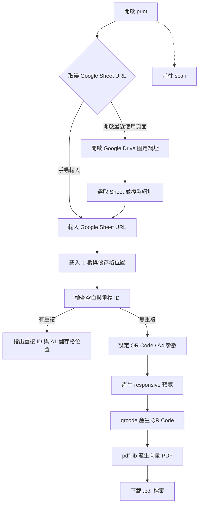

# QR Code PDF 產生功能規格

本目錄負責從 Google Sheet 讀取盤點項目，產生 QR Code 標籤 PDF 檔案。
`print` 以電腦為主要操作環境，但必須支援平板與手機 RWD；在手機上也
可以透過頁面入口前往 `scan` 進行盤點。

掃描場景模擬器的規劃請參考
[QR Code 掃描場景模擬器規格](./scan_simulation_spec.md)。

共通流程以 [`docs/architecture.md`](../docs/architecture.md) 為準，套件
清單見 [`docs/packages.md`](../docs/packages.md)。Google Sheet URL 的取得方式
見 [`google_sheet/GET_GOOGLE_SHEET_URL.md`](../google_sheet/GET_GOOGLE_SHEET_URL.md)。

## 前端技術決策

`print` 是 **純前端靜態網頁**，正式環境不需要任何自建後端服務。

固定技術棧：

- Vue 3。
- Composition API + `<script setup lang="ts">`。
- TypeScript。
- Vite。
- SCSS / Sass。
- Vuetify 4.x：操作介面使用的 UI framework。
- `vite-plugin-vuetify`：Vite 編譯時按需載入 Vuetify 元件。
- npm `qrcode`：在瀏覽器產生 QR Code，預覽使用 SVG。
- npm `pdf-lib`：在瀏覽器本機產生可下載的 PDF，QR Code 使用向量模組。
- Google Drive 最近使用頁面：透過固定網址開啟，讓使用者手動選取
  Google Sheet 並複製網址。

第一版不使用 Vue Router、Pinia、Nuxt、第二套 UI framework 或自建後端。

### UI framework 使用範圍

`print` 的操作介面統一使用 Vuetify 4.x，包含表單控制項、按鈕、訊息、
對話框、進度狀態與 responsive layout。元件透過 `vite-plugin-vuetify`
按需載入；theme 與共用設計 token 集中設定。

Vuetify 不取代列印資料的語意與實體尺寸處理：

- QR label 與 A4 預覽仍使用語意化 HTML、專案 SCSS，以及 `mm` / `pt`
  實體單位。
- PDF 仍由 `qrcode` + `pdf-lib` 在瀏覽器本機產生，不由 Vuetify 或
  `window.print()` 產生。
- 語系選擇器等規格指定的原生 HTML 控制項必須保留；所有操作仍須符合
  [`accessibility.mdc`](../.cursor/rules/accessibility.mdc) 的鍵盤、焦點、
  live region 與螢幕閱讀器要求。

編譯方式與部署規範請參考 [`build/README.md`](../build/README.md)。

---

## 使用流程



所有使用者輸入或調整內容，都要保存到 `localStorage`。`print` 不更新
Google Sheet，也不呼叫 Apps Script 寫入盤點結果。

### `print` 與 `scan` 入口

頁面必須提供「前往 scan」按鈕或連結，讓使用者在平板或手機上可直接
切換到盤點 App：

- 同網域部署時使用相對路徑。
- 不同網域部署時使用 `VITE_SCAN_APP_URL`。
- 連結只負責導覽，不把 `scan` URL 編入 QR Code。

---

## 開啟最近使用的 Google Sheet

`print` 只提供固定連結開啟 Google Drive 最近使用的試算表頁面，不建立
Google Cloud Project、不設定 OAuth Client ID，也不使用 Google Drive API：

[開啟最近使用的 Google Sheet](https://drive.google.com/drive/u/0/recent?q=type:spreadsheet)

操作步驟：

1. 開啟上方連結。
2. 在 Google Drive 中選取要使用的 Google Sheet。
3. 複製瀏覽器網址列的完整 Google Sheet URL。
4. 回到 `print`，將網址貼到 Google Sheet URL 欄位。

這個連結只負責導覽，不會自動列出檔案，也不會自動把 Sheet URL
帶回 `print`；使用者仍可直接手動貼上已知的 Google Sheet URL。

---

## 資料來源

使用者可以手動輸入完整 Google Sheet 網址，也可以先開啟「最近使用的
Google Sheet」連結，選取檔案後複製網址再貼上。

```text
https://docs.google.com/spreadsheets/d/xxxxxxxxxxxxxxxxxxxxxxxxxxxxxxxxxxxxxxxxxxxx/edit
```

前端解析 Spreadsheet ID。

第一版欄位：

```text
id | name | checked_time | location
```

`name` 是 ID 的人類可識別名稱，可留白；`print` 仍以 `id` 作為 QR Code
payload 與主要列印識別。列印功能載入時也必須保留每筆資料的實際列號，
以便指出重複 ID 位於哪些儲存格。

### Google Sheet 權限

- 使用者必須具備該 Google Sheet 的讀取權限。
- 開啟最近使用頁面時，Google Drive 會依使用者目前的 Google 帳號與權限
  顯示可存取的檔案。
- 固定連結不會繞過 Google Sheet 的存取權限，也不會替 `print` 建立登入
  或授權流程。
- 不建立自建後端代讀 Sheet。

---

## QR Code 內容與產生方式

每一筆有效 `id` 產生一張 QR Code。payload 只放 ID 本身，例如 `A01`。

不可加入 Google Sheet URL、Apps Script URL、JSON、`checked_time`、`location` 或額外前後綴。

QR Code 下方顯示同一筆 ID 的可讀文字。使用 npm `qrcode` 套件在瀏覽器產生 SVG；不要用低解析度 canvas / PNG 再以 CSS 放大列印。

---

## 頁面輸入項目

### Google Sheet 網址

必要欄位。

需求：

- 可手動輸入 / 貼上。
- 提供「開啟最近使用的 Google Sheet」連結。
- 驗證 Google Sheet URL。
- 解析 Spreadsheet ID。
- 保存到 `localStorage`。
- 下次開啟自動帶入。
- 提供「重新讀取」。

### 列印參數

第一版至少提供：QR Code 尺寸、ID 文字大小、QR Code 與 ID 文字間距、標籤間距、頁面邊界、紙張方向（直向 / 橫向）。預設紙張 A4。

所有參數修改後立即更新預覽，或提供明確「更新預覽」，並保存到 `localStorage`。

QR Code 實體尺寸使用 `mm`，例如預設 `30 mm × 30 mm`；ID 字體可使用 `pt`。

---

## localStorage

key 統一使用 `mis.print.*` prefix。

```text
mis.print.google_sheet_url
mis.print.qr_size_mm
mis.print.id_font_size_pt
mis.print.qr_text_gap_mm
mis.print.label_gap_mm
mis.print.page_margin_mm
mis.print.orientation
```

可提供「重設為預設值」清除本頁設定。

---

## ID 資料處理

- 第一列視為 header。
- 依欄位名稱找 `id`，不要硬綁固定欄號。
- 忽略空白 ID。
- ID 保持字串型態。
- 保留 Sheet 原始順序。
- 保留每筆 ID 對應的試算表列號，並換算為 A1 儲存格位置，例如 `A2`。
- 重複判定以載入後的非空 ID 字串為準；同一 ID 出現於多個資料列時，
  必須在載入報表時立即提示。
- 重複提示必須逐組列出 ID 與所有出現位置，例如：
  `A01：A2、A8、A14`。
- 重複提示必須是可讀取的文字，不可只使用顏色、標記或圖示。
- 只要存在重複 ID，就不得產生 QR Code 預覽、PDF 或直接列印結果；
  使用者修正 Google Sheet 後，重新載入才可繼續。

載入成功後顯示 Google Sheet 名稱或 Spreadsheet ID、有效 ID 總數、資料錯誤數量。
若有重複 ID，另顯示重複 ID 組數、每組 ID 與所有 A1 儲存格位置。
讀取失敗時清除 / 標記舊資料，不能讓使用者誤以為舊資料是本次結果。

---

## 報表預覽

頁面顯示接近實際列印結果的 A4 預覽。QR Code 與 ID 必須保持同一標籤，標籤不可被分頁切開，自動依尺寸計算每列數量並換列 / 換頁，多頁要有清楚分隔。

預覽與 `@media print` 使用相同尺寸變數，避免畫面與列印規格各算一套。

---

## PDF 產生

第一版由瀏覽器本機使用 `pdf-lib` 產生 PDF，不使用 `window.print()`、瀏覽
器列印對話框或自建後端。

PDF 產生器必須：

- 使用 A4 實體尺寸與 `mm` / `pt` 轉換。
- 依預覽使用的同一組版面參數計算欄列、間距與換頁。
- 以 `qrcode` 的 QR matrix 繪製向量模組，保留足夠 quiet zone。
- 在 QR Code 下方繪製相同的 ID 文字。
- 確保每個標籤完整位於單一頁面內。
- 產生 `Blob` 後提供 `.pdf` 下載。

輸出的 PDF 是可儲存、分享或交給實體印表機的檔案；`print` 不直接呼叫
印表機，也不依賴瀏覽器的 PDF 另存功能。

---

## QR Code 品質

- 使用 SVG。
- 保留足夠 quiet zone。
- 黑白對比清楚。
- 不使用 bitmap CSS 放大。
- 產出的紙本必須能被 `scan` 可靠辨識。

---

## 建議元件 / 程式分層

```text
src/
├── components/
│   ├── GoogleSheetSource.vue
│   ├── PrintSettings.vue
│   ├── PrintPreview.vue
│   └── QrLabel.vue
├── composables/
│   └── usePrintSettings.ts
├── services/
│   ├── sheet_source.ts
│   ├── qr_generator.ts
│   └── pdf_generator.ts
├── styles/
│   ├── main.scss
│   └── print.scss
├── types/
├── utils/
├── App.vue
└── main.ts
```

Component 不直接散落資料來源讀取或 QR library 操作；統一透過 service / composable。

---

## 錯誤處理

至少處理：

- Google Sheet URL 格式錯誤。
- Google Sheet 資料讀取失敗。
- 使用者沒有該 Sheet 的讀取權限。
- 找不到 `id` 欄位。
- Sheet 沒有有效 ID。
- 出現重複 ID。
- QR Code 產生失敗。
- PDF 產生或下載失敗。

---

## 第一版完成條件

- [ ] Vue 3 + TypeScript + Vite + SCSS 專案可用 Podman build。
- [ ] `./frontend.sh build print` 成功產生 `print/dist/`。
- [ ] 可手動輸入並保存 Google Sheet URL。
- [ ] 有「開啟最近使用的 Google Sheet」連結。
- [ ] 連結使用 `https://drive.google.com/drive/u/0/recent?q=type:spreadsheet`。
- [ ] 使用者可從 Google Drive 複製 Sheet URL，再貼回 `print`。
- [ ] 不需要 Google Cloud Project、OAuth Client ID 或 Google Drive API。
- [ ] 可從 URL 解析 Spreadsheet ID。
- [ ] 可依輸入的 Google Sheet URL 讀取有權限的 Sheet。
- [ ] 可接受額外的 `name` 欄位，且不影響 QR Code payload。
- [ ] 可從 `id` 欄取得所有有效 ID。
- [ ] 載入時可找出重複 ID，並指出每個重複 ID 所在的 A1 儲存格位置。
- [ ] 有重複 ID 時不產生 QR Code 預覽、PDF 或直接列印結果。
- [ ] 每個 ID 產生 SVG QR Code並顯示 ID。
- [ ] 可設定 QR Code 實體尺寸與基本列印參數。
- [ ] 所有列印偏好保存到 `localStorage`。
- [ ] A4 自動排列與分頁。
- [ ] 可預覽。
- [ ] 使用 `pdf-lib` 產生向量 QR Code PDF。
- [ ] 可下載產生的 PDF 檔案。
- [ ] 提供前往 `scan` 的入口。

## 第一版不做

- 透過 Apps Script 產生 QR Code。
- 寫入 `checked_time` 或 `location`。
- 手機掃描功能。
- 自訂任意紙張規格。
- 複雜標籤模板設計器。
- 自建後端。
- 直接控制實體印表機。
