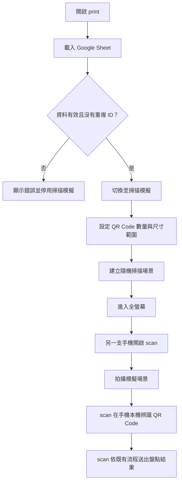

# QR Code 掃描場景模擬器規格

> 狀態：已實作第一版。

本功能在 `print` App 中提供一個可全螢幕瀏覽的 QR Code 模擬場景，
讓使用者使用另一支手機開啟 `scan`，拍攝並辨識畫面中的多個 QR Code。

模擬器只負責顯示 QR Code，不直接執行手機掃描、不接收掃描結果，也不
寫入 Google Sheet。

## 1. 功能定位

`print` 頁面新增模式切換：

- `PDF 列印`：目前既有的 PDF 標籤產生功能。
- `掃描模擬`：新增的虛擬 QR Code 貼紙場景。

兩個模式共用：

- Google Sheet 載入結果。
- 有效 ID 與重複 ID 檢查。
- QR Code SVG 產生服務。
- `前往 scan` 入口。

預設仍進入 `PDF 列印`，不得影響目前的列印流程。

## 2. 使用流程



`print` 與 `scan` 第一版不做即時同步。使用者可以在電腦或平板顯示
模擬場景，再用手機上的 `scan` 拍照辨識。

## 3. 虛擬場景

模擬器顯示一個可捲動的虛擬牆：

- 單一畫面大約顯示 10 個 QR Code。
- 數量超過約 10 個時，其餘 QR Code 放到相鄰畫面，以水平與垂直捲動查看。
- 使用瀏覽器原生捲軸。
- 場景可透過鍵盤捲動。
- QR Code 以隨機位置散佈。
- QR Code 之間不得重疊。
- 每張 QR Code 必須完整位於場景範圍內。
- 單一畫面空間不足時，自動擴大該畫面，不讓 QR Code 重疊或消失。
- 第一版不提供滑鼠或觸控拖曳平移。

概念畫面：

```text
┌──────────────────────────────────────────────┐
│ 掃描模擬工具列                                │
├──────────────────────────────────────────────┤
│                                              │
│       ┌──────┐                    ┌────────┐ │
│       │ QR   │        ┌────┐      │  QR    │ │
│       │      │        │ QR │      │        │ │
│       └──────┘        └────┘      └────────┘ │
│          A01              B02          C03    │
│                                              │
│   ┌──────────────┐                  ┌──────┐  │
│   │              │       ┌───┐      │ QR   │  │
│   │      QR      │       │QR │      │      │  │
│   │              │       └───┘      └──────┘  │
│   └──────────────┘         D04          E05    │
│                                              │
└──────────────────────────────────────────────┘
                 水平捲軸
```

## 4. QR Code 標籤外觀

每張 QR Code 模擬實際列印標籤：

- 白色標籤背景。
- 黑白 QR Code。
- 標籤文字、字級、QR／文字間距與顯示內容（隱藏／ID／名稱）跟隨列印設定。
- 模擬場景的畫面尺寸仍用 `px` 範圍隨機縮放，不修改 PDF 的 `qrSizeMm`。
- 保留 QR Code quiet zone。
- 使用現有 `qrcode` 套件產生 SVG，並重用列印預覽的標籤元件。
- QR Code payload 依列印設定的標籤文字模式產生：選擇「ID」或隱藏文字時使用 ID，選擇「名稱」時使用名稱；沒有名稱時退回使用 ID。
- 不加入 Google Sheet URL、Apps Script URL、`location` 或其他資料。

## 5. 模擬器控制項

### 5.1 QR Code 數量

提供數量選擇器：

- 5 張。
- 10 張。
- 20 張。
- 全部 ID。

數量超過目前有效 ID 數量時，自動限制為實際可用數量。

建議預設為 10 張；有效 ID 少於 10 張時顯示全部。

選取固定數量時，依 Google Sheet 原始順序取前 N 筆，位置仍以 seed
隨機排列。

### 5.2 QR Code 大小

提供：

- 最小 QR Code 尺寸。
- 最大 QR Code 尺寸。

建立場景時，每張 QR Code 在設定範圍內隨機決定尺寸。

初步建議使用螢幕尺寸 `px`，例如：

```text
最小尺寸：96 px
最大尺寸：240 px
```

此尺寸代表畫面顯示大小，不代表 PDF 的實體 `mm` 尺寸。

### 5.3 建立場景

`建立場景` 獨立一排、全寬按鈕。按下後建立場景並進入全螢幕。

### 5.4 場景縮放

提供：

- 放大。
- 縮小。
- 重設為 100%。
- 目前縮放倍率文字。

建議縮放範圍為 50% 至 200%，每次調整 10%。縮放後必須同步更新
水平與垂直捲動範圍。

### 5.5 隨機排列

提供：

- `重新隨機排列`：產生新的 seed 與位置。
- `使用相同 seed 重建`：重現相同的尺寸與位置。

畫面不顯示目前使用的 seed。同一個 seed 應產生相同的：

- QR Code 選取結果。
- QR Code 大小。
- QR Code 位置。

## 6. 全螢幕模式

按下 `建立場景` 後，只讓模擬畫布進入全螢幕。工具列、狀態訊息與其他按鈕
都不顯示。另外提供獨立的 `進入全螢幕`／`離開全螢幕` 按鈕，使用瀏覽器
Fullscreen API。

全螢幕時：

- 只有模擬場景畫布佔滿畫面。
- 使用 `Esc` 離開全螢幕。
- 離開全螢幕後，焦點回到原本的全螢幕按鈕。
- 不支援 Fullscreen API 時，退回一般頁面最大化顯示，同樣只顯示畫布，
  並可用 `Esc` 離開。
- 全螢幕狀態以文字通知，不只依靠畫面變化，並說明可按 `Esc` 離開。

## 7. 資料來源與限制

模擬器只使用目前成功載入的 Google Sheet 資料：

- 不新增手動 ID 輸入。
- 不呼叫 Apps Script。
- 不寫入 Google Sheet。
- 不上傳圖片。
- Sheet 載入失敗時清除或停用舊場景。
- 有重複 ID 時禁止建立場景。
- QR Code payload 依列印設定的標籤文字模式產生；名稱為空時退回使用有效 ID。

## 8. 設定保存

使用 `localStorage` 保存模擬器設定，但不保存每張 QR Code 的實際座標。

建議 key：

```text
mis.print.simulator.item_count
mis.print.simulator.min_qr_size_px
mis.print.simulator.max_qr_size_px
mis.print.simulator.zoom
mis.print.simulator.seed
```

重新整理後：

- 恢復上次的模擬器設定。
- 依保存的 seed 重新計算場景。
- 不保存整份 layout JSON。
- 不影響既有 `mis.print.*` PDF 設定。

## 9. 無障礙要求

- 模擬器使用語意化 `section` 與清楚的標題。
- 每個控制項都有可見 label。
- 每張 QR Code 的 ID 都以文字存在 DOM。
- QR Code 圖片具有可理解的 accessible name，例如「QR Code，ID A01」。
- QR Code 使用語意化清單或文章結構呈現。
- 建立完成時以 live region 通知：

  ```text
  掃描場景建立完成，共顯示 10 個 QR Code。
  ```

- 場景捲動容器可使用鍵盤操作。
- 不使用正數 `tabindex`。
- 全螢幕、縮放與重新排列控制項都有清楚名稱。
- 200% 放大後控制項仍可使用。
- 重要狀態不可只依賴顏色或圖示。

## 10. 錯誤處理

至少處理：

- 尚未載入 Google Sheet。
- Google Sheet 沒有有效 ID。
- 存在重複 ID。
- QR Code 產生失敗。
- 最小尺寸大於最大尺寸。
- 設定值超出允許範圍。
- 場景無法容納所有 QR Code。
- 瀏覽器不支援全螢幕。
- QR Code 數量超過可用 ID 數量。

## 11. 建議程式結構

預計修改：

```text
print/src/App.vue
print/src/types/print.ts
print/src/i18n/messages/en.ts
print/src/i18n/messages/zh_tw.ts
print/src/styles/main.scss
```

預計新增：

```text
print/src/components/ScanSimulator.vue
print/src/composables/use_scan_simulation.ts
print/src/utils/scene_layout.ts
```

元件應重用既有的 Google Sheet 載入服務、QR Code SVG 產生服務與 QR
標籤視覺，不在 component 內直接散落資料讀取或 QR library 操作。

## 12. 第一版不做

- `print` 與 `scan` 即時同步。
- 顯示手機目前掃描到哪一張。
- 從 `scan` 回傳掃描結果到 `print`。
- 手動拖曳 QR Code。
- 手動輸入單張 QR Code 位置。
- 匯出模擬場景圖片。
- 直接控制另一台手機。
- 修改現有 PDF 排版與下載行為。
- 持續開啟相機預覽。

## 13. 完成條件

- [x] `print` 可切換 PDF 列印與掃描模擬模式。
- [x] 只有資料有效且沒有重複 ID 時才能建立場景。
- [x] 可選擇 QR Code 數量。
- [x] QR Code 會以不同大小隨機排列。
- [x] QR Code 不重疊且不超出場景。
- [x] 場景可水平與垂直捲動。
- [x] 可使用鍵盤操作捲軸與控制項。
- [x] 可進入與離開全螢幕。
- [x] 可放大、縮小與重設場景。
- [x] 相同 seed 可重現相同場景。
- [x] 設定會保存到 `mis.print.*`。
- [x] 每張 QR Code 下方依列印設定顯示可讀的 ID 或名稱。
- [x] 手機 `scan` 可以拍攝模擬器畫面並辨識多張 QR Code。
- [x] `./frontend.sh build print` 成功。

## 14. 第一版採用值

1. 單一畫面大約顯示 10 個 QR Code；超過的數量依約 10 個一組排到相鄰畫面，並以捲動查看。單一畫面空間不足時自動擴大。
2. QR Code 模擬尺寸使用畫面 `px`，預設範圍為 `96–240 px`，允許範圍為 `48–480 px`。
3. QR Code 數量選項採用 `5／10／20／全部`，超過有效 ID 數量時取實際可用數量。
