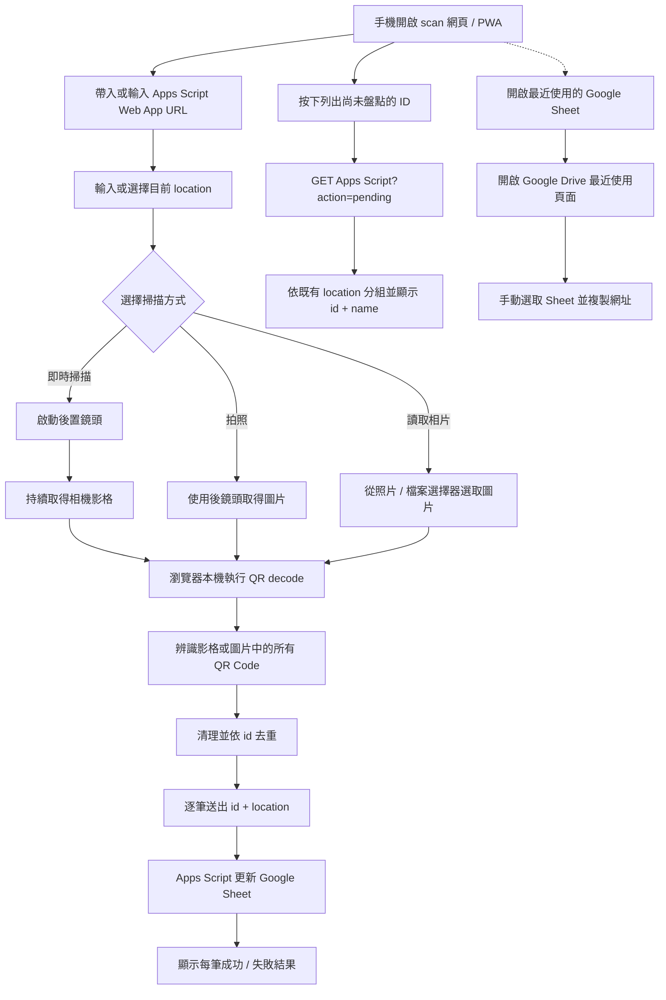

# QR Code 手機即時掃描與盤點功能規格

本目錄負責手機端的 QR Code 即時掃描、圖片辨識與盤點寫入。

共通流程以 [`docs/architecture.md`](../docs/architecture.md) 為準，套件
清單見 [`docs/packages.md`](../docs/packages.md)。Apps Script Web App URL
的取得方式見
[`google_sheet/GET_APPS_SCRIPT_URL.md`](../google_sheet/GET_APPS_SCRIPT_URL.md)。

第一版支援持續開啟後鏡頭的即時掃描，也支援以「拍照」或「讀取相片」
取得圖片後辨識一個或多個 QR Code。兩種模式都在瀏覽器本機處理影像，
不會上傳照片。

## 前端技術決策

`scan` 是 **純前端靜態 PWA**，正式環境不需要任何自建後端服務。

固定技術棧：

- Vue 3。
- Composition API + `<script setup lang="ts">`。
- TypeScript。
- Vite。
- SCSS / Sass。
- Vuetify 4.x：手機盤點操作介面使用的 UI framework。
- `vite-plugin-vuetify`：Vite 編譯時按需載入 Vuetify 元件。
- `vite-plugin-pwa`：產生 PWA manifest / Service Worker。
- `@undecaf/zbar-wasm`：在瀏覽器本機辨識 QR Code，支援相機影格與
  圖片中的多個 QR Code。
- `MediaDevices.getUserMedia()`：取得使用者同意的後置鏡頭影像，供即時掃描使用。
- Google Drive 最近使用頁面：透過固定網址開啟，讓使用者手動選取
  Google Sheet 並複製網址。

第一版不使用 Vue Router、Pinia、Nuxt 或第二套 UI framework。影像只在使用者
裝置內處理，不把照片上傳到伺服器。

### UI framework 使用範圍

`scan` 的手機優先操作介面統一使用 Vuetify 4.x，包含表單控制項、主要
操作按鈕、狀態訊息、結果列表、對話框與 responsive layout。元件透過
`vite-plugin-vuetify` 按需載入；theme 與共用設計 token 集中設定。

拍照與讀取相片仍必須使用規格指定的原生
`<input type="file" accept="image/*" capture="environment">`，不可用 UI
framework 的替代元件破壞 Android Chrome 與 iPhone Safari 的相機入口。
QR Code 圖片辨識、Apps Script 呼叫與 PWA 行為也不屬於 UI framework 責任。
所有控制項、動態狀態與錯誤通知仍須符合
[`accessibility.mdc`](../.cursor/rules/accessibility.mdc) 的鍵盤、焦點、
live region 與螢幕閱讀器要求。

編譯方式與部署規範請參考 [`build/README.md`](../build/README.md)。

---

## 使用流程



網頁中所有一般使用者設定都必須保存到 `localStorage`。

---

## 使用裝置

第一版主要針對 Android Chrome、iPhone Safari，並可安裝成 PWA 使用。

即時掃描透過瀏覽器相機 API 保持 camera preview；拍照模式則透過瀏覽器
檔案 / 相機輸入介面取得單張圖片。相機只在使用者主動啟動掃描或拍照時使用。

---

## PWA

至少包含 manifest、Service Worker、App icon、可加入手機主畫面與 Standalone 顯示模式。

PWA 快取的目的，是讓 App shell 與 QR decode 靜態資源可以再次啟動；第一版
**不代表支援離線盤點**。Apps Script 寫入與 Google Drive 網頁仍需要網路。

`@undecaf/zbar-wasm` 所需 WASM 資源要跟著 build 部署，不把第三方 CDN 當成必要 runtime dependency。

---

## Google Drive 最近使用的 Sheet 快速入口

設定區必須提供明顯連結：

```text
開啟最近使用的 Google Sheet
```

用途是讓使用者在手機盤點時快速找到目前要操作的 Google Sheet，不必先手動
進入 Google Drive 搜尋。

按下後：

1. 開啟固定網址：
   `https://drive.google.com/drive/u/0/recent?q=type:spreadsheet`。
2. 在 Google Drive 中手動選取要使用的 Google Sheet。
3. 複製瀏覽器網址列的完整 Google Sheet URL。
4. 若要在 `print` 使用該試算表，將網址貼到 `print` 的 Google Sheet URL
   欄位；`scan` 寫入盤點資料仍使用另外設定的 Apps Script Web App URL。
5. 優先另開分頁或交由系統可用的 Google Sheets / 瀏覽器處理，避免直接
   丟失目前 scan 畫面狀態。
6. 返回 `scan` 後，原本輸入的 Apps Script URL、location 與掃描狀態不得
   被清除。

### 與 Apps Script URL 的關係

Google Drive 最近使用頁面只協助使用者找到並開啟 Google Sheet，**不能自動
取得 Bound Apps Script 已部署的 Web App `/exec` URL**。

因此此功能定位為「快速找到並開啟對應 Google Sheet」，不假裝能由 Sheet
自動推導 Apps Script Web App URL。`scan` 寫入盤點資料時仍以使用者設定的
Apps Script Web App URL 為準。

這個快速入口不應阻擋主要盤點流程；Google Drive 無法開啟時，使用者仍可
直接使用已保存的 Apps Script URL 盤點。

---

## 頁面輸入項目

### Apps Script Web App 網址

必要欄位，例如：

```text
https://script.google.com/macros/s/xxxxxxxxxxxxxxxx/exec
```

需求：可手動輸入或貼上、保存到 `localStorage`、下次自動帶入、呼叫失敗時顯示清楚錯誤。

在此欄位附近提供「開啟最近使用的 Google Sheet」連結，協助使用者快速
找到對應的盤點表；此連結的操作方式依上方說明，使用者需手動複製並貼回
Google Sheet URL。

### 目前位置

必要欄位，例如：

```text
主機房 A 區
倉庫 2F
辦公室 305
```

需求：

- location 不可為空。
- 保存最近使用位置到 `localStorage`。
- 提供「歷史位置下拉選單」。
- 使用者曾輸入過的位置可快速選取。
- 相同位置不要重複。
- 新位置在執行盤點後加入歷史紀錄。
- 仍可自由輸入新位置。
- 第一版可保留最近 20 筆位置。

---

## 尚未盤點清單

設定區提供「列出尚未盤點的 ID」功能，使用同一個 Apps Script Web App
`/exec` URL 發送：

```text
GET <APPS_SCRIPT_WEB_APP_URL>?action=pending
```

Apps Script 依 `checked_time` 是否為空白判定尚未盤點，回傳每筆的：

```json
{
  "id": "B03",
  "name": "桌上型電腦",
  "checked_time": "",
  "location": "倉庫 2F"
}
```

`scan` 顯示人類可識別的 `name` 與 `id`，並依資料原本的 `location` 分組。
沒有位置的項目統一放在「尚未設定位置」群組。`name` 未填時以 `id` 顯示，
不會因此遺漏該筆資料。

清單是使用者按下按鈕時重新讀取的結果；盤點成功後，畫面中的該 ID 會從
尚未盤點清單移除。讀取失敗時必須保留清楚的錯誤文字，不可把空清單誤報
成「全部完成」。

---

## localStorage

key 統一使用 `mis.scan.*` prefix：

```text
mis.scan.apps_script_url
mis.scan.location
mis.scan.location_history
```

重新整理或重新開啟 PWA 後保留；可清除歷史位置與所有設定。

---

## 主要操作按鈕

第一版主要影像操作為 `開始掃描`、`停止相機`、`拍照` 與 `讀取相片`。
Google Sheet 快速入口屬於設定輔助連結，不與主要掃描動作混在同一層級。

### 即時掃描

即時掃描使用瀏覽器 `getUserMedia()` 取得後置鏡頭影像，並以
`requestAnimationFrame` 或等效的節流迴圈逐影格交給
`@undecaf/zbar-wasm` 辨識。

需求：

- 使用者按下「開始掃描」後才請求相機權限。
- 預設使用後鏡頭，不要求麥克風權限。
- 提供清楚的「停止相機」按鈕；停止時釋放所有 MediaStream tracks。
- QR Code 辨識期間顯示文字狀態，不可只顯示 loading 動畫。
- 同一個 QR Code 持續出現在畫面中時，不得在每個影格重複送出；
  需在掃描 session 內去重或套用明確的冷卻時間。
- 一個影格辨識到多個 QR Code 時，先依 `id` 去重，再逐筆送出。
- 相機權限被拒絕、裝置沒有相機或串流啟動失敗時，顯示可理解的錯誤與
  下一步提示，並保留「拍照辨識」替代流程。

### 拍照

```html
<input type="file" accept="image/*" capture="environment">
```

拍照完成後立即辨識，作為即時掃描不可用時的替代流程。

### 讀取相片

開啟手機照片 / 檔案選擇器；第一版一次處理一張圖片，選取後立即辨識。

---

## QR Code 圖片辨識

使用 `@undecaf/zbar-wasm` 對相機影格或圖片轉成的 `ImageData` 進行本機
辨識。

需求：

- 即時掃描每次辨識影格中所有可辨識 QR Code，不可只取第一個。
- 圖片模式一次取得圖片中所有可辨識 QR Code，不可只取第一個。
- 只接受 QR Code 類型作為盤點 ID。
- QR Code payload 直接視為 `id`。
- 去除 ID 前後空白，不修改大小寫。
- ID 保持字串型態。
- 同一影格或同一張圖片相同 ID 只送出一次；即時掃描 session 也不得因
  QR Code 持續停留在畫面中而重複送出。
- 圖片不離開瀏覽器。

若沒有 QR Code，顯示：`此圖片中沒有辨識到 QR Code`。

---

## Apps Script 呼叫

每個唯一 ID 各送出一次請求，語意資料為：

```json
{
  "id": "A01",
  "location": "主機房 A 區"
}
```

實際 HTTP transport 由 `src/services/` 封裝，必須能由瀏覽器直接呼叫 Apps Script，不建立自建 proxy server。第一版建議逐筆或低併發處理，讓 UI 可明確對應每一筆狀態。

Apps Script 回傳格式依 [`google_sheet/README.md`](../google_sheet/README.md) 定義。

成功範例：

```json
{
  "success": true,
  "item": {
    "id": "A01",
    "name": "印表機",
    "checked_time": "20260829-171000",
    "location": "主機房 A 區"
  },
  "message": "Inventory check succeeded"
}
```

失敗範例：

```json
{
  "success": false,
  "id": "A99",
  "error": "ID_NOT_FOUND",
  "message": "Item ID not found: A99"
}
```

Apps Script 回應的 `message` 欄位一律使用英文；畫面若要顯示繁體中文，
應依 `error` 代碼進行 UI 映射。

---

## 掃描結果列表

每筆至少顯示 ID、等待送出 / 寫入中 / 成功 / 失敗、Apps Script 回傳訊息；成功時顯示 `checked_time` 與 `location`。

同一張圖片即使部分 ID 失敗，也必須繼續處理其他 ID。全部完成後顯示本次成功 / 失敗統計。

---

## 建議元件 / 程式分層

```text
src/
├── components/
│   ├── ScanSettings.vue
│   ├── CameraScanner.vue
│   ├── ImageSourceButtons.vue
│   ├── ScanResultList.vue
│   └── PendingInventoryList.vue
├── composables/
│   ├── useScanSettings.ts
│   └── useScanSession.ts
├── services/
│   ├── apps_script.ts
│   └── qr_decoder.ts
├── styles/
├── types/
├── utils/
├── App.vue
└── main.ts
```

Component 不直接散落 Google Drive 導覽、Apps Script `fetch()` 或 QR library
操作；統一透過 service / composable。

---

## 錯誤處理

至少處理：

- 未設定 Apps Script URL：`Please enter the Apps Script Web App URL`。
- 未輸入位置：`Please enter the current location`。
- 相機權限被拒絕、裝置沒有相機或相機啟動失敗。
- 圖片無 QR Code：`No QR Code was detected in this image`。
- 圖片讀取失敗：`Unable to read the image. Please select it again`。
- Apps Script 無法連線：`Unable to connect to the inventory service`。
- 尚未盤點清單讀取失敗：顯示可理解的錯誤，不能顯示為空清單。
- ID 不存在：顯示 Apps Script 回傳的英文 `message`。
- 多筆中的單筆失敗：不得中止其他 ID。

---

## 隱私與權限

只使用必要功能：

- 相機：使用者按「開始掃描」或「拍照」時由瀏覽器呼叫，停止即時掃描
  後釋放串流。
- 圖片：使用者主動按「讀取相片」時選取。
- Google Drive 最近使用頁面：透過固定網址開啟，不要求 `scan` 取得
  Google OAuth 或 Drive API 權限。

不需要 GPS、麥克風、聯絡人或背景持續使用相機。

---

## 第一版完成條件

- [ ] Vue 3 + TypeScript + Vite + SCSS 專案可用 Podman build。
- [ ] `./frontend.sh build scan` 成功產生 `scan/dist/`。
- [ ] 手機可開啟 HTTPS 網頁並安裝成 PWA。
- [ ] 可輸入並保存 Apps Script Web App URL。
- [ ] 有「開啟最近使用的 Google Sheet」連結。
- [ ] 連結使用 `https://drive.google.com/drive/u/0/recent?q=type:spreadsheet`。
- [ ] 使用者可從 Google Drive 複製 Sheet URL，再貼回 `print`。
- [ ] 不需要 Google Cloud Project、OAuth Client ID 或 Google Drive API。
- [ ] 可輸入並保存目前位置，並有歷史位置下拉選單。
- [ ] 可啟動後置鏡頭進行即時 QR Code 掃描。
- [ ] 可停止相機並釋放相機串流。
- [ ] 即時掃描中同一個 QR Code 不會因持續出現在畫面中而重複送出。
- [ ] 可按「拍照」取得新照片。
- [ ] 可按「讀取相片」選擇既有圖片。
- [ ] 可從一張圖片辨識多個 QR Code。
- [ ] QR decode 全部在本機瀏覽器完成。
- [ ] 同張圖片的重複 ID 不重複送出。
- [ ] 每個 ID 都帶 location 呼叫 Apps Script。
- [ ] 可顯示每個 ID 的等待 / 寫入中 / 成功 / 失敗狀態。
- [ ] 單筆失敗不影響其他 QR Code。
- [ ] 可透過同一個 Apps Script `/exec` URL 列出 `checked_time` 空白的 ID。
- [ ] 尚未盤點清單顯示 `name` 與 `id`，並依 `location` 分組。
- [ ] 沒有 `location` 的項目會歸入「尚未設定位置」。

## 第一版不做

- 從 Google Sheet 自動推導 Bound Apps Script Web App `/exec` URL。
- GPS 自動取得位置。
- 離線盤點 queue。
- 手動輸入 ID。
- 從手機端修改 Google Sheet 欄位定義。
- 在手機端決定正式 `checked_time`。
- 自建後端 / CORS proxy。
