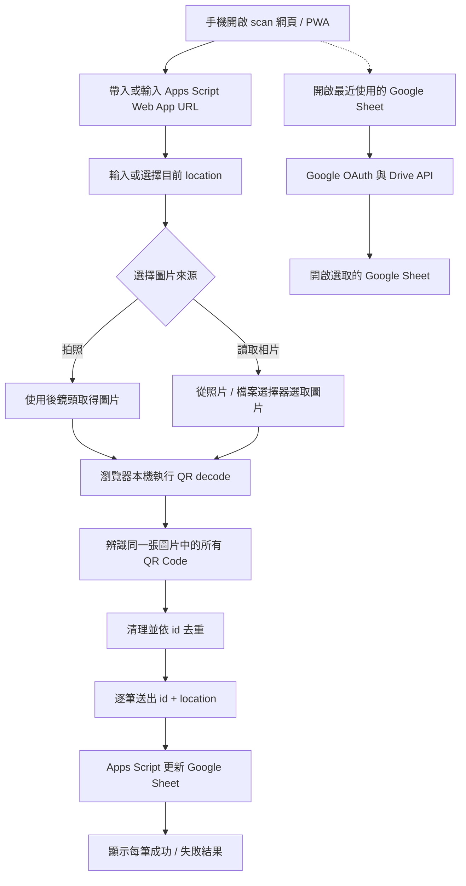

# QR Code 手機盤點功能規格

本目錄負責手機端的 QR Code 圖片辨識與盤點寫入。

共通流程以 [`docs/architecture.md`](../docs/architecture.md) 為準，套件
清單見 [`docs/packages.md`](../docs/packages.md)。Apps Script Web App URL
的取得方式見 [`google_sheet/README.md`](../google_sheet/README.md)。

第一版不做持續開啟鏡頭的即時掃描，而是以「拍照」或「讀取相片」取得圖片，再從圖片中辨識一個或多個 QR Code。

## 前端技術決策

`scan` 是 **純前端靜態 PWA**，正式環境不需要任何自建後端服務。

固定技術棧：

- Vue 3。
- Composition API + `<script setup lang="ts">`。
- TypeScript。
- Vite。
- SCSS / Sass。
- `vite-plugin-pwa`：產生 PWA manifest / Service Worker。
- `@undecaf/zbar-wasm`：在瀏覽器本機辨識 QR Code，支援同張圖片多個 QR Code。
- Google Identity Services：僅在使用「最近使用的 Google Sheet」快速入口時進行 Google OAuth。
- Google Drive API：列出最近開啟的 Google Sheets，方便快速開啟對應盤點表。

第一版不使用 Vue Router、Pinia、Nuxt 或大型 UI framework。影像只在使用者裝置內處理，不把照片上傳到伺服器。

### 編譯方式

主機只需要安裝 Podman，不要求安裝 Node.js / npm。

```bash
./frontend.sh image
./frontend.sh install scan
./frontend.sh dev scan
./frontend.sh build scan
```

開發預設網址：`http://localhost:5173`。

正式輸出目錄：`scan/dist/`，可直接部署到 HTTPS 靜態網站，不需要 Node.js runtime。

---

## 使用流程



網頁中所有一般使用者設定都必須保存到 `localStorage`；OAuth access token 除外。

---

## 使用裝置

第一版主要針對 Android Chrome、iPhone Safari，並可安裝成 PWA 使用。

拍照透過瀏覽器檔案 / 相機輸入介面呼叫手機相機，不需要長時間保持 camera preview。

---

## PWA

至少包含 manifest、Service Worker、App icon、可加入手機主畫面與 Standalone 顯示模式。

PWA 快取的目的，是讓 App shell 與 QR decode 靜態資源可以再次啟動；第一版 **不代表支援離線盤點**。Apps Script 寫入與 Google Drive 最近檔案查詢仍需要網路。

`@undecaf/zbar-wasm` 所需 WASM 資源要跟著 build 部署，不把第三方 CDN 當成必要 runtime dependency。

---

## Google Drive 最近使用的 Sheet 快速入口

設定區必須提供明顯按鈕：

```text
開啟最近使用的 Google Sheet
```

用途是讓使用者在手機盤點時快速找到目前要操作的 Google Sheet，不必先手動進入 Google Drive 搜尋。

按下後：

1. 若尚未取得 Google OAuth 權限，先執行登入 / 授權。
2. 使用 Google Drive API `files.list` 讀取目前帳號最近開啟的檔案。
3. 只顯示 MIME type 為 `application/vnd.google-apps.spreadsheet` 的 Google Sheets。
4. 依 `viewedByMeTime desc` 排序，最近開啟的 Sheet 放最前面。
5. 第一版預設顯示最近 20 筆，可視需要提供「載入更多」。
6. 每筆至少顯示檔名與最近開啟時間。
7. 點選某一筆後，以該檔案的 `webViewLink` / Google Sheet URL 開啟 Google Sheet；手機上優先另開分頁或交由系統可用的 Google Sheets / 瀏覽器處理，避免直接丟失目前 scan 畫面狀態。
8. 返回 `scan` 後，原本輸入的 Apps Script URL、location 與掃描狀態不得被清除。
9. 取消選取不得改動任何 scan 設定。

Drive 查詢概念：

```text
q: mimeType = 'application/vnd.google-apps.spreadsheet' and trashed = false
orderBy: viewedByMeTime desc
fields: nextPageToken, files(id,name,viewedByMeTime,modifiedTime,webViewLink)
```

### 與 Apps Script URL 的關係

Google Drive API 可以找到 Google Sheet，但**不能把 Bound Apps Script 已部署的 Web App `/exec` URL 視為該 Sheet 的標準 Drive 欄位直接取得**。

因此第一版此功能定位為「快速找到並開啟對應 Google Sheet」，不假裝能由 Sheet 自動推導 Apps Script Web App URL。`scan` 寫入盤點資料時仍以使用者設定的 Apps Script Web App URL 為準。

這個快速入口不應阻擋主要盤點流程；Drive API / OAuth 發生錯誤時，使用者仍可直接使用已保存的 Apps Script URL 盤點。

---

## 頁面輸入項目

### Apps Script Web App 網址

必要欄位，例如：

```text
https://script.google.com/macros/s/xxxxxxxxxxxxxxxx/exec
```

需求：可手動輸入或貼上、保存到 `localStorage`、下次自動帶入、呼叫失敗時顯示清楚錯誤。

在此欄位附近提供「開啟最近使用的 Google Sheet」，協助使用者快速找到對應的盤點表。

### 目前位置

必要欄位，例如：

```text
主機房 A 區
倉庫 2F
辦公室 305
```

需求：

- location 不可為空。
- 保存最近使用位置到 `localStorage`。
- 提供「歷史位置下拉選單」。
- 使用者曾輸入過的位置可快速選取。
- 相同位置不要重複。
- 新位置在執行盤點後加入歷史紀錄。
- 仍可自由輸入新位置。
- 第一版可保留最近 20 筆位置。

---

## localStorage

key 統一使用 `mis.scan.*` prefix：

```text
mis.scan.apps_script_url
mis.scan.location
mis.scan.location_history
```

重新整理或重新開啟 PWA 後保留；可清除歷史位置與所有設定。OAuth access token 不長期保存到 localStorage。

---

## 主要操作按鈕

第一版兩個主要影像來源按鈕：`拍照`、`讀取相片`。Google Sheet 快速入口屬於設定輔助按鈕，不與這兩個主要掃描動作混在同一層級。

### 拍照

```html
<input type="file" accept="image/*" capture="environment">
```

優先使用後鏡頭，拍照完成後立即辨識，不做即時掃描 camera preview。

### 讀取相片

開啟手機照片 / 檔案選擇器；第一版一次處理一張圖片，選取後立即辨識。

---

## QR Code 圖片辨識

使用 `@undecaf/zbar-wasm` 對圖片轉成的 `ImageData` 進行本機辨識。

需求：

- 一次取得圖片中所有可辨識 QR Code，不可只取第一個。
- 只接受 QR Code 類型作為盤點 ID。
- QR Code payload 直接視為 `id`。
- 去除 ID 前後空白，不修改大小寫。
- ID 保持字串型態。
- 同張圖片相同 ID 只送出一次。
- 圖片不離開瀏覽器。

若沒有 QR Code，顯示：`此圖片中沒有辨識到 QR Code`。

---

## Apps Script 呼叫

每個唯一 ID 各送出一次請求，語意資料為：

```json
{
  "id": "A01",
  "location": "主機房 A 區"
}
```

實際 HTTP transport 由 `src/services/` 封裝，必須能由瀏覽器直接呼叫 Apps Script，不建立自建 proxy server。第一版建議逐筆或低併發處理，讓 UI 可明確對應每一筆狀態。

Apps Script 回傳格式依 [`google_sheet/README.md`](../google_sheet/README.md) 定義。

成功範例：

```json
{
  "success": true,
  "item": {
    "id": "A01",
    "checked_time": "20260829-171000",
    "location": "主機房 A 區"
  },
  "message": "Inventory check succeeded"
}
```

失敗範例：

```json
{
  "success": false,
  "id": "A99",
  "error": "ID_NOT_FOUND",
  "message": "Item ID not found: A99"
}
```

Apps Script 回應的 `message` 欄位一律使用英文；畫面若要顯示繁體中文，
應依 `error` 代碼進行 UI 映射。

---

## 掃描結果列表

每筆至少顯示 ID、等待送出 / 寫入中 / 成功 / 失敗、Apps Script 回傳訊息；成功時顯示 `checked_time` 與 `location`。

同一張圖片即使部分 ID 失敗，也必須繼續處理其他 ID。全部完成後顯示本次成功 / 失敗統計。

---

## 建議元件 / 程式分層

```text
src/
├── components/
│   ├── ScanSettings.vue
│   ├── RecentGoogleSheetsPicker.vue
│   ├── ImageSourceButtons.vue
│   └── ScanResultList.vue
├── composables/
│   ├── useGoogleAuth.ts
│   ├── useScanSettings.ts
│   └── useScanSession.ts
├── services/
│   ├── google_auth.ts
│   ├── google_drive.ts
│   ├── apps_script.ts
│   └── qr_decoder.ts
├── styles/
├── types/
├── utils/
├── App.vue
└── main.ts
```

Component 不直接散落 Google OAuth、Drive API、Apps Script `fetch()` 或 QR library 操作；統一透過 service / composable。

---

## 錯誤處理

至少處理：

- 未設定 Apps Script URL：`Please enter the Apps Script Web App URL`。
- 未輸入位置：`Please enter the current location`。
- Google OAuth 失敗。
- Drive 最近檔案讀取失敗。
- 最近沒有 Google Sheet。
- 圖片無 QR Code：`No QR Code was detected in this image`。
- 圖片讀取失敗：`Unable to read the image. Please select it again`。
- Apps Script 無法連線：`Unable to connect to the inventory service`。
- ID 不存在：顯示 Apps Script 回傳的英文 `message`。
- 多筆中的單筆失敗：不得中止其他 ID。

---

## 隱私與權限

只使用必要功能：

- 相機：使用者按「拍照」時由瀏覽器呼叫。
- 圖片：使用者主動按「讀取相片」時選取。
- Google Drive 唯讀權限：只有使用者主動按「開啟最近使用的 Google Sheet」時才需要，用於列出最近使用的 Google Sheets。

不需要 GPS、麥克風、聯絡人或背景持續使用相機。

---

## 第一版完成條件

- [ ] Vue 3 + TypeScript + Vite + SCSS 專案可用 Podman build。
- [ ] `./frontend.sh build scan` 成功產生 `scan/dist/`。
- [ ] 手機可開啟 HTTPS 網頁並安裝成 PWA。
- [ ] 可輸入並保存 Apps Script Web App URL。
- [ ] 有「開啟最近使用的 Google Sheet」按鈕。
- [ ] 可透過 Google Drive API 顯示最近開啟的 Google Sheets。
- [ ] 最近使用清單依 `viewedByMeTime` 由新到舊排序。
- [ ] 點選 Sheet 後可開啟該 Google Sheet，且返回 scan 後原設定不遺失。
- [ ] Drive 快速入口失敗不影響已設定 Apps Script URL 的正常盤點。
- [ ] 可輸入並保存目前位置，並有歷史位置下拉選單。
- [ ] 可按「拍照」取得新照片。
- [ ] 可按「讀取相片」選擇既有圖片。
- [ ] 可從一張圖片辨識多個 QR Code。
- [ ] QR decode 全部在本機瀏覽器完成。
- [ ] 同張圖片的重複 ID 不重複送出。
- [ ] 每個 ID 都帶 location 呼叫 Apps Script。
- [ ] 可顯示每個 ID 的等待 / 寫入中 / 成功 / 失敗狀態。
- [ ] 單筆失敗不影響其他 QR Code。

## 第一版不做

- 持續開啟相機的即時 QR Code scanner。
- 從 Google Sheet 自動推導 Bound Apps Script Web App `/exec` URL。
- GPS 自動取得位置。
- 離線盤點 queue。
- 手動輸入 ID。
- 修改 Google Sheet 資料結構。
- 在手機端決定正式 `checked_time`。
- 自建後端 / CORS proxy。
