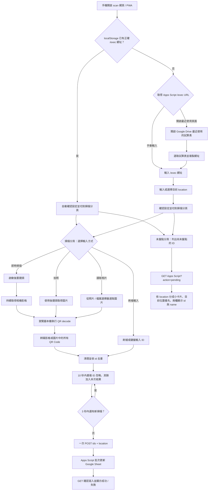

# QR Code 手機即時掃描與盤點功能規格

本目錄負責手機端的 QR Code 即時掃描、圖片辨識與盤點寫入。
`scan` 是獨立網頁，只負責掃描與盤點，不包含 QR Code 列印功能。

共通流程以 [`docs/architecture.md`](../docs/architecture.md) 為準，套件
清單見 [`docs/packages.md`](../docs/packages.md)。Apps Script Web App URL
的取得方式見
[`google_sheet/GET_APPS_SCRIPT_URL.md`](../google_sheet/GET_APPS_SCRIPT_URL.md)。

第一版支援持續開啟後鏡頭的即時掃描，也支援以「拍照」或「讀取相片」
取得圖片後辨識一個或多個 QR Code。兩種模式都在瀏覽器本機處理影像，
不會上傳照片。

## 前端技術決策

`scan` 是 **純前端靜態 PWA**，正式環境不需要任何自建後端服務。

固定技術棧：

- Vue 3。
- Composition API + `<script setup lang="ts">`。
- TypeScript。
- Vite。
- SCSS / Sass。
- Vuetify 4.x：手機盤點操作介面使用的 UI framework。
- `vite-plugin-vuetify`：Vite 編譯時按需載入 Vuetify 元件。
- `vue-router`：底部功能分頁使用 hash 路由，可用網址切換。
- `@mdi/font`：提供 Material Design Icons，供掃描操作按鈕與「最近使用的
  Apps Script」圖示使用。
- `@undecaf/zbar-wasm`：在瀏覽器本機辨識 QR Code，支援相機影格與
  圖片中的多個 QR Code。
- `MediaDevices.getUserMedia()`：取得使用者同意的後置鏡頭影像，供即時掃描使用。
- 瀏覽器 `BarcodeDetector`：在支援的環境補強 QR Code 辨識，與 zbar 結果合併。

第一版不使用 Pinia、Nuxt 或第二套 UI framework。影像只在使用者
裝置內處理，不把照片上傳到伺服器。`scan` 使用 `vue-router` 的 hash
路由切換底部功能分頁；`print` 仍不使用 Vue Router。

### UI framework 使用範圍

`scan` 的手機優先操作介面統一使用 Vuetify 4.x，包含表單控制項、主要
操作按鈕、狀態訊息、結果列表、對話框與 responsive layout。元件透過
`vite-plugin-vuetify` 按需載入；theme 與共用設計 token 集中設定。

拍照與讀取相片仍必須使用規格指定的原生
`<input type="file" accept="image/*" capture="environment">`，不可用 UI
framework 的替代元件破壞 Android Chrome 與 iPhone Safari 的相機入口。
QR Code 圖片辨識、Apps Script 呼叫與 PWA 行為也不屬於 UI framework 責任。
所有控制項、動態狀態與錯誤通知仍須符合
[`accessibility.mdc`](../.cursor/rules/accessibility.mdc) 的鍵盤、焦點、
live region 與螢幕閱讀器要求。

編譯方式與部署規範請參考 [`build/README.md`](../build/README.md)。

---

## 使用流程



網頁中所有一般使用者設定都必須保存到 `localStorage`。

畫面採手機 App 底部四個功能分頁，以 `vue-router` hash 路由切換：

- **設定** `#/settings`：Apps Script `/exec` 網址與目前位置。
- **掃描** `#/scan`：即時相機、拍照、讀取相片、刷槍輸入，以及目前位置。
- **已盤點** `#/checked`：本次掃描結果。
- **未盤點** `#/pending`：Google Sheet 中尚未盤點的項目。

根路徑 `#/` 會依是否已有正確 `/exec` 網址導向掃描或設定。離開掃描分頁時會停止相機並釋放鏡頭。

---

## 使用裝置

第一版主要針對 Android Chrome、iPhone Safari，並可安裝成 PWA 使用。

即時掃描透過瀏覽器相機 API 保持 camera preview；拍照模式則透過瀏覽器
檔案 / 相機輸入介面取得單張圖片。相機只在使用者主動啟動掃描或拍照時使用。

---

## PWA

使用靜態 manifest、App icon、可加入手機主畫面與 Standalone 顯示模式。
PWA 不註冊 Service Worker，也不使用 HTML5 Cache Storage 快取檔案；第一版
不支援離線盤點，Apps Script 寫入仍需要網路。

`@undecaf/zbar-wasm` 所需 WASM 資源要跟著 build 部署，不把第三方 CDN 當成必要 runtime dependency。

---

## 頁面輸入項目

### Apps Script Web App 網址

必要欄位，例如：

```text
https://script.google.com/macros/s/xxxxxxxxxxxxxxxx/exec
```

需求：只能使用部署後的 `/exec` 網址，不使用 `/dev` 測試網址；可手動輸入或
貼上、保存到 `localStorage`、下次自動帶入。若重新開啟時網址已存在且格式
正確，會自動完成「確認設定」並切到掃描分頁。呼叫失敗時顯示清楚錯誤。
`scan` 不提供 Google 登入功能，權限與資料存取由 Apps Script Web App 處理。
使用者也可以先開啟「最近使用的 Google Sheet」連結，選取試算表後複製網址。

### 開啟最近使用的 Google Sheet

`scan` 提供與 `print` 相同的固定連結開啟 Google Drive 最近使用的試算表，
不建立 Google Cloud Project、不設定 OAuth Client ID，也不使用 Google Drive API：

[開啟最近使用的 Google Sheet](https://drive.google.com/drive/u/0/recent?q=type:spreadsheet)

操作步驟：

1. 開啟上方連結。
2. 在 Google Drive 中選取要使用的 Google Sheet。
3. 進入該 Google Sheet 的 **Extensions > Apps Script**。
4. 依部署流程取得結尾為 `/exec` 的 Web app URL，貼回 `scan`。

這個連結只負責導覽，不會自動把網址帶回 `scan`；使用者仍可直接手動貼上
已知的 Apps Script `/exec` 網址。

### 目前位置

必要欄位，例如：

```text
主機房 A 區
倉庫 2F
辦公室 305
```

需求：

- location 可留白；留白時保留 Google Sheet 中該 ID 原本的位置，有輸入內容才更新位置。
- 保存最近使用位置到 `localStorage`。
- 提供「歷史位置下拉選單」。
- 使用者曾輸入過的位置可快速選取。
- 相同位置不要重複。
- 只有盤點成功後才將該位置加入歷史紀錄。
- 仍可自由輸入新位置。
- 變更目前位置時，清除本次盤點結果，因為使用者已換到其他地方盤點。
- 第一版可保留最近 20 筆位置。

---

## 尚未盤點清單

設定區與未盤點分頁提供「列出尚未盤點的 ID」功能，使用同一個 Apps Script Web App
`/exec` URL 發送：

```text
GET <APPS_SCRIPT_WEB_APP_URL>?action=pending
```

Apps Script 依 `checked_time` 是否為空白判定尚未盤點，回傳每筆的：

```json
{
  "id": "B03",
  "name": "桌上型電腦",
  "checked_time": "",
  "location": "倉庫 2F"
}
```

`scan` 把載入按鈕與清單放在同一張卡片。顯示人類可識別的 `name` 與 `id`，
以兩欄列點呈現，並依資料原本的 `location` 分成小卡片。沒有位置的項目
統一放在「尚未設定位置」群組。與目前設定位置相同的群組會排在最前面，
並標示為目前位置。`name` 未填時以 `id` 顯示，不會因此遺漏該筆資料。

清單是使用者按下按鈕時重新讀取的結果；盤點成功後，畫面中的該 ID 會從
尚未盤點清單移除。讀取失敗時必須保留清楚的錯誤文字，不可把空清單誤報
成「全部完成」。

---

## localStorage

key 統一使用 `mis.scan.*` prefix：

```text
mis.scan.apps_script_url
mis.scan.location
mis.scan.location_history
mis.scan.input_mode
```

重新整理或重新開啟 PWA 後保留；可清除歷史位置與所有設定。

---

## 主要操作按鈕

第一版主要影像操作為 `開始掃描`、`停止相機`、`拍照` 與 `讀取相片`。
掃描分頁也可切換成刷槍輸入，改以鍵盤楔入的條碼機連續輸入 ID。

### 即時掃描

即時掃描使用瀏覽器 `getUserMedia()` 取得後置鏡頭影像，並以
`requestAnimationFrame` 或等效的節流迴圈逐影格交給
`@undecaf/zbar-wasm` 辨識；若瀏覽器提供 `BarcodeDetector`，會同時用來
補強 QR Code 辨識。相機影格會縮小後再解碼，必要時再掃一次畫面中央裁切，
避免手機高解析度畫面讓 WASM 過慢或對不到碼。

需求：

- 使用者按下「開始掃描」後才請求相機權限。
- 預設使用後鏡頭，不要求麥克風權限。
- 瀏覽器支援時啟用連續對焦；預覽畫面可點擊對焦，鍵盤啟動時對準畫面中央。
- 提供清楚的「停止相機」按鈕；停止時釋放所有 MediaStream tracks。
- QR Code 辨識期間顯示文字狀態，不可只顯示 loading 動畫。
- 同一個 QR Code 持續出現在畫面中時，不得在每個影格重複送出；
  同一 ID 在 10 秒內不重複送出，超過 10 秒可以再次盤點。
- 一個影格辨識到多個 QR Code 時，先依 `id` 去重；掃描後若 3 秒內沒有
  新的 ID，再一次批次送出。
- 相機權限被拒絕、裝置沒有相機或串流啟動失敗時，顯示可理解的錯誤與
  下一步提示，並保留「拍照辨識」替代流程。

### 拍照

```html
<input type="file" accept="image/*" capture="environment">
```

拍照完成後立即辨識，作為即時掃描不可用時的替代流程。

### 讀取相片

開啟手機照片 / 檔案選擇器；第一版一次處理一張圖片，選取後立即辨識。

### 刷槍輸入

掃描分頁可切換成輸入框，供手持刷槍或條碼機使用。刷槍以鍵盤方式輸入
ID，通常會自動送出 Enter。連續掃描多個 ID 後，若 3 秒內沒有新輸入，
就與相機掃描相同，一次批次送出。輸入方式保存在
`mis.scan.input_mode`。

需求：

- 切換模式時停止相機並釋放鏡頭。
- 進入刷槍模式後，焦點移到輸入欄位，方便連續掃描。
- 輸入框必須有明確 label；不可只用 placeholder。
- 手動輸入可用 Enter 或「加入這個 ID」送出目前內容。
- 3 秒沒有新輸入且欄位仍有內容時，把該內容視為一個 ID 並立即批次送出。
- 同一 ID 仍套用 10 秒冷卻。

---

## QR Code 圖片辨識

使用 `@undecaf/zbar-wasm` 對相機影格或圖片轉成的 `ImageData` 進行本機
辨識；支援 `BarcodeDetector` 的瀏覽器會並行使用原生 QR 偵測，結果與
zbar 合併去重。

需求：

- 即時掃描每次辨識影格中所有可辨識 QR Code，不可只取第一個。
- 圖片模式一次取得圖片中所有可辨識 QR Code，不可只取第一個。
- 只接受 QR Code 類型作為盤點 ID。
- QR Code payload 直接視為 `id`。
- 去除 ID 前後空白，不修改大小寫。
- ID 保持字串型態。
- 同一影格或同一張圖片相同 ID 只送出一次；即時掃描同一個 ID 在 10 秒內
  不重複送出。超過 10 秒後可以再次盤點。
- 圖片不離開瀏覽器。

若沒有 QR Code，顯示：`此圖片中沒有辨識到 QR Code`。

---

## Apps Script 呼叫

掃描後會先把 ID 放進本次結果。若連續 3 秒沒有新的掃描內容，再一次
批次送出：

```json
{
  "ids": ["A01", "A02"],
  "location": "主機房 A 區"
}
```

前端不守候 POST 回應是否可讀；接著用 `GET ?action=list` 確認
`checked_time` 已更新。單筆 ID 失敗不得中止同一批次其他 ID。

實際 HTTP transport 由 `src/services/` 封裝，必須能由瀏覽器直接呼叫 Apps Script，不建立自建 proxy server。

Apps Script 回傳格式依 [`google_sheet/README.md`](../google_sheet/README.md) 定義。變更此契約後需要重新部署 Web App。

成功範例：

```json
{
  "success": true,
  "items": [
    {
      "id": "A01",
      "name": "印表機",
      "checked_time": "20260829-171000",
      "location": "主機房 A 區"
    }
  ],
  "results": [
    {
      "success": true,
      "item": {
        "id": "A01",
        "name": "印表機",
        "checked_time": "20260829-171000",
        "location": "主機房 A 區"
      }
    }
  ],
  "message": "Inventory check completed"
}
```

失敗範例：

```json
{
  "success": false,
  "id": "A99",
  "error": "ID_NOT_FOUND",
  "message": "Item ID not found: A99"
}
```

Apps Script 回應的 `message` 欄位一律使用英文；畫面若要顯示繁體中文，
應依 `error` 代碼進行 UI 映射。

---

## 掃描結果列表

每筆至少顯示 ID、等待批次送出 / 寫入中 / 成功 / 失敗；成功時顯示 `checked_time` 與 `location`。

同一張圖片即使部分 ID 失敗，也必須繼續處理其他 ID。全部完成後顯示本次成功 / 失敗統計。

---

## 建議元件 / 程式分層

```text
src/
├── components/
│   ├── ScanSettings.vue
│   ├── CameraScanner.vue
│   ├── ImageSourceButtons.vue
│   ├── ScanResultList.vue
│   └── PendingInventoryList.vue
├── composables/
│   ├── useScanSettings.ts
│   └── useScanSession.ts
├── services/
│   ├── apps_script.ts
│   └── qr_decoder.ts
├── styles/
├── types/
├── utils/
├── App.vue
└── main.ts
```

Component 不直接散落 Apps Script `fetch()` 或 QR library 操作；統一透過
service / composable。

---

## 錯誤處理

至少處理：

- 未設定 Apps Script URL：`Please enter the Apps Script Web App URL`。
- 未輸入位置：`Please enter the current location`。
- 相機權限被拒絕、裝置沒有相機或相機啟動失敗。
- 圖片無 QR Code：`No QR Code was detected in this image`。
- 圖片讀取失敗：`Unable to read the image. Please select it again`。
- Apps Script 無法連線：`Unable to connect to the inventory service`。
- 尚未盤點清單讀取失敗：顯示可理解的錯誤，不能顯示為空清單。
- ID 不存在：顯示 Apps Script 回傳的英文 `message`。
- 多筆中的單筆失敗：不得中止其他 ID。

---

## 隱私與權限

只使用必要功能：

- 相機：使用者按「開始掃描」或「拍照」時由瀏覽器呼叫，停止即時掃描
  後釋放串流。
- 圖片：使用者主動按「讀取相片」時選取。
不需要 GPS、麥克風、聯絡人或背景持續使用相機。

---

## 第一版完成條件

- [ ] Vue 3 + TypeScript + Vite + SCSS 專案可用 Podman build。
- [ ] `./frontend_build.sh` 成功產生 `scan/dist/` 與 `print/dist/`。
- [ ] 手機可開啟 HTTPS 網頁並安裝成 PWA。
- [ ] 可輸入並保存 Apps Script Web App URL。
- [ ] 有「開啟最近使用的 Google Sheet」連結。
- [ ] 連結使用 `https://drive.google.com/drive/u/0/recent?q=type:spreadsheet`。
- [ ] 使用者可從 Google Sheet 的 Apps Script 部署複製 `/exec` URL，再貼回 `scan`。
- [ ] 不需要 Google Cloud Project、OAuth Client ID 或 Google Drive API。
- [ ] 底部四個功能分頁可切換設定、掃描、已盤點與未盤點。
- [ ] 可用 `#/settings`、`#/scan`、`#/checked`、`#/pending` 直接開啟對應分頁。
- [ ] 可輸入並保存目前位置，並有歷史位置下拉選單。
- [ ] 可啟動後置鏡頭進行即時 QR Code 掃描。
- [ ] 可停止相機並釋放相機串流。
- [ ] 即時掃描中同一個 QR Code 在 10 秒內不會因持續出現在畫面中而重複送出。
- [ ] 可按「拍照」取得新照片。
- [ ] 可按「讀取相片」選擇既有圖片。
- [ ] 可從一張圖片辨識多個 QR Code。
- [ ] QR decode 全部在本機瀏覽器完成。
- [ ] 同張圖片的重複 ID 不重複送出。
- [ ] 3 秒內沒有新掃描後，一次批次送出 `ids` 與 location。
- [ ] 可顯示每個 ID 的等待批次送出 / 寫入中 / 成功 / 失敗狀態。
- [ ] 單筆失敗不影響其他 QR Code。
- [ ] 可透過同一個 Apps Script `/exec` URL 列出 `checked_time` 空白的 ID。
- [ ] 尚未盤點清單顯示 `name` 與 `id`，並依 `location` 分組。
- [ ] 沒有 `location` 的項目會歸入「尚未設定位置」。

## 第一版不做

- 從 Google Sheet 自動推導 Bound Apps Script Web App `/exec` URL。
- GPS 自動取得位置。
- 離線盤點 queue。
- 手動輸入 ID。
- 從手機端修改 Google Sheet 欄位定義。
- 在手機端決定正式 `checked_time`。
- 自建後端 / CORS proxy。
